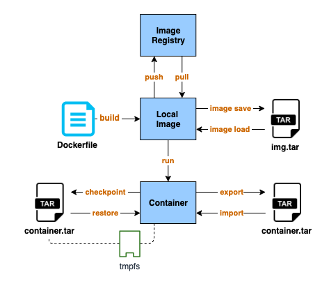

Podman - Part I:  Introduction
===============================

Introduction
-------------

As you may have noticed, Red Hat replaces the docker daemon with CRI-O/podman since RHEL 8.
So what is Podman? Accoring to the definition on [Podman official website](https://podman.io/),

> Podman is a daemonless container engine for developing, managing, and running OCI Containers on your Linux System. Containers can either be run as root or in rootless mode.

Why Red Hat want to get rid of docker daemon? Because there are few problems with running docker with docker daemon

- Single point of failure issue, once the daemon died, all container died.
- This daemon process owned all the child processes for the running containers.
- All Docker operations had to be conducted by a user with the same full root authority.
- Building containers could led to security vulnerabilities.

So podman solve above issues by directly interact with Image registry, containers and image storage instead of work through a daemon. And the rootless mode allow a user run containers without the full root authority.
Besides, it also provides a docker compatible command line experience enabling users to pull, build, push and run containers.

### Docker vs Podman


Podman interact with Linux kernel to manage containers through the runC container runtime process instead of a daemon
. The [buildah](https://buildah.io/) utility is used to replace docker build as the container images build tool and docker push is replaced by [skopeo](https://github.com/containers/skopeo) for moving container images between registries, and container engines.


Installation and Setup
------------------------

For RHEL7, subscribe rhel-7-server-extras-rpms yum repository and then enable Extras channel and install Podman.

```
sudo subscription-manager repos --enable=rhel-7-server-extras-rpms
sudo yum -y install podman
```

### Rootless mode?
Podman support rootless mode, for more details to set up rootless mode on Redhat 7, please refer:
https://www.redhat.com/en/blog/preview-running-containers-without-root-rhel-76

This article will focus on the basic usage of podman.


Basic Usage
------------

Most of Podman commands are similar to docker command. If you’ve used the docker cli, you will be quite familiar with podman.

```bash
# Pull mage
sudo podman pull nginx

# List images
sudo podman images

# Run container
sudo podman run -dt -p 8081:80/tcp -v /opt/http:/usr/share/nginx/html:ro --name hello-nginx nginx
```


Checkpoint and Restore
------------------------------



If you running container with [tmpfs volume](https://docs.docker.com/storage/tmpfs/), then export/import can not be the backup solution for that container because `export` does not back up the memory content. The files in the tmpfs volume will lost when you `import` the container from tar file. Here is `checkpoint/restore` come in. For docker, you need to turn on experimantal feature to enable the feature. Podman can use these feature directly without doing any change.

### Run container that support checkpoint

The `criu` package is required to do checkpoint/restore. And you have to add --security-opt="seccomp=unconfined" when running a container on RHEL because CRIU cannot correctly handle seccomp on RHEL7

```
sudo yum install -y criu
sudo podman run -dt --tmpfs /tmp -v /opt/http:/usr/share/nginx/html --security-opt="seccomp=unconfined" --name hello-nginx nginx
```

### Create file in /tmp/ folder
```
sudo podman exec -it hello-nginx touch /tmp/test-01
```

### Create checkpoint and export as file.
```
sudo podman container checkpoint --leave-running --export=/tmp/backup.tar hello-nginx
```

### Restore from file
```
sudo podman stop hello-nginx
sudo podman rm hello-nginx
sudo podman container restore --import=/tmp/backup.tar
```

### Verify data does not lost in /tmp/ folder

```
$ sudo podman exec -it hello-nginx ls /tmp/test-01
/tmp/test-01
```

Conclution
-----------

As the replacement of docker, podman provides same developer experience as Docker while doing things in a slightly more secure way in the background. You could alias `docker` with `podman` and never notice that there is a completely different tool managing your local containers. Besides, with the daemonless design and the rootless mode, Podman is a bit more isolated and more secure to use than Docker. You should really consider to start using podman instead of installing docker-ce on your local machine.

