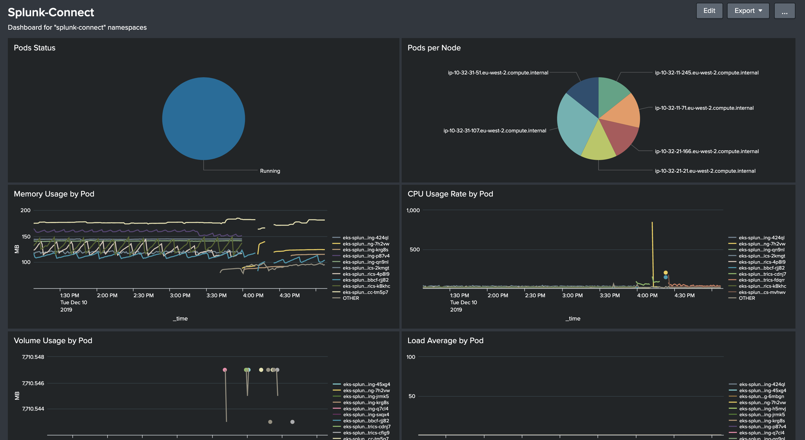

Monitor Kubernetes apps with Splunk - Part 5 : Splunk Dashboard and alerts
==========================================================================

This blog give examples of the splunk dashboard and alerts

Dashboard for Particular Namespace
----------------------------------




Dashboard Source

```xml
<dashboard theme="dark">
  <label>Splunk-Connect</label>
  <description>Dashboard for "splunk-connect" namespaces</description>
  <row>
    <panel>
      <title>Pods Status</title>
      <chart>
        <search>
          <query>index="eks_objects" metadata.namespace="splunk-connect" | stats distinct_count(metadata.uid) AS Pod_Num by status.phase</query>
          <earliest>-15m</earliest>
          <latest>now</latest>
          <sampleRatio>1</sampleRatio>
        </search>
        <option name="charting.chart">pie</option>
        <option name="charting.drilldown">none</option>
        <option name="refresh.display">progressbar</option>
        <option name="trellis.enabled">0</option>
        <option name="trellis.scales.shared">1</option>
        <option name="trellis.size">medium</option>
      </chart>
    </panel>
    <panel>
      <title>Pods per Node</title>
      <chart>
        <search>
          <query>index="eks_objects" metadata.namespace="splunk-connect" status.phase="Running" | stats distinct_count(metadata.uid) AS Pod_Num by spec.nodeName</query>
          <earliest>-15m</earliest>
          <latest>now</latest>
          <sampleRatio>1</sampleRatio>
        </search>
        <option name="charting.axisLabelsX.majorLabelStyle.overflowMode">ellipsisNone</option>
        <option name="charting.axisLabelsX.majorLabelStyle.rotation">0</option>
        <option name="charting.axisTitleX.visibility">visible</option>
        <option name="charting.axisTitleY.visibility">visible</option>
        <option name="charting.axisTitleY2.visibility">visible</option>
        <option name="charting.axisX.abbreviation">none</option>
        <option name="charting.axisX.scale">linear</option>
        <option name="charting.axisY.abbreviation">none</option>
        <option name="charting.axisY.scale">linear</option>
        <option name="charting.axisY2.abbreviation">none</option>
        <option name="charting.axisY2.enabled">0</option>
        <option name="charting.axisY2.scale">inherit</option>
        <option name="charting.chart">pie</option>
        <option name="charting.chart.bubbleMaximumSize">50</option>
        <option name="charting.chart.bubbleMinimumSize">10</option>
        <option name="charting.chart.bubbleSizeBy">area</option>
        <option name="charting.chart.nullValueMode">gaps</option>
        <option name="charting.chart.showDataLabels">none</option>
        <option name="charting.chart.sliceCollapsingThreshold">0.01</option>
        <option name="charting.chart.stackMode">default</option>
        <option name="charting.chart.style">shiny</option>
        <option name="charting.drilldown">none</option>
        <option name="charting.layout.splitSeries">0</option>
        <option name="charting.layout.splitSeries.allowIndependentYRanges">0</option>
        <option name="charting.legend.labelStyle.overflowMode">ellipsisMiddle</option>
        <option name="charting.legend.mode">standard</option>
        <option name="charting.legend.placement">right</option>
        <option name="charting.lineWidth">2</option>
        <option name="refresh.display">progressbar</option>
        <option name="trellis.enabled">0</option>
        <option name="trellis.scales.shared">1</option>
        <option name="trellis.size">medium</option>
      </chart>
    </panel>
  </row>
  <row>
    <panel>
      <title>Memory Usage by Pod</title>
      <chart>
        <search>
          <query>| mstats avg(_value) as "Avg" where index=eks_metrics AND metric_name="kube.pod.memory.usage.bytes" AND namespace="splunk-connect" span=1m by pod_name
| eval mem_mb = Avg / 1024 / 1024
| timechart avg(mem_mb) as "Mem" span=1m by pod_name</query>
          <earliest>-4h@m</earliest>
          <latest>now</latest>
          <sampleRatio>1</sampleRatio>
        </search>
        <option name="charting.axisLabelsX.majorLabelStyle.overflowMode">ellipsisNone</option>
        <option name="charting.axisLabelsX.majorLabelStyle.rotation">0</option>
        <option name="charting.axisTitleX.visibility">visible</option>
        <option name="charting.axisTitleY.text">MB</option>
        <option name="charting.axisTitleY.visibility">visible</option>
        <option name="charting.axisTitleY2.visibility">visible</option>
        <option name="charting.axisX.abbreviation">none</option>
        <option name="charting.axisX.scale">linear</option>
        <option name="charting.axisY.abbreviation">none</option>
        <option name="charting.axisY.scale">linear</option>
        <option name="charting.axisY2.abbreviation">none</option>
        <option name="charting.axisY2.enabled">0</option>
        <option name="charting.axisY2.scale">inherit</option>
        <option name="charting.chart">line</option>
        <option name="charting.chart.bubbleMaximumSize">50</option>
        <option name="charting.chart.bubbleMinimumSize">10</option>
        <option name="charting.chart.bubbleSizeBy">area</option>
        <option name="charting.chart.nullValueMode">gaps</option>
        <option name="charting.chart.showDataLabels">none</option>
        <option name="charting.chart.sliceCollapsingThreshold">0.01</option>
        <option name="charting.chart.stackMode">default</option>
        <option name="charting.chart.style">shiny</option>
        <option name="charting.drilldown">none</option>
        <option name="charting.layout.splitSeries">0</option>
        <option name="charting.layout.splitSeries.allowIndependentYRanges">0</option>
        <option name="charting.legend.labelStyle.overflowMode">ellipsisMiddle</option>
        <option name="charting.legend.mode">standard</option>
        <option name="charting.legend.placement">right</option>
        <option name="charting.lineWidth">2</option>
        <option name="refresh.display">progressbar</option>
        <option name="trellis.enabled">0</option>
        <option name="trellis.scales.shared">1</option>
        <option name="trellis.size">medium</option>
      </chart>
    </panel>
    <panel>
      <title>CPU Usage Rate by Pod</title>
      <chart>
        <search>
          <query>| mstats avg(_value) as "Avg" where index=eks_metrics AND metric_name="kube.pod.cpu.usage_rate" AND pod-namespace="splunk-connect" span=1m by pod-name
| timechart avg(Avg) as CPU span=1m by pod-name</query>
          <earliest>-4h@m</earliest>
          <latest>now</latest>
          <sampleRatio>1</sampleRatio>
        </search>
        <option name="charting.axisLabelsX.majorLabelStyle.overflowMode">ellipsisNone</option>
        <option name="charting.axisLabelsX.majorLabelStyle.rotation">0</option>
        <option name="charting.axisTitleX.visibility">visible</option>
        <option name="charting.axisTitleY.visibility">visible</option>
        <option name="charting.axisTitleY2.visibility">visible</option>
        <option name="charting.axisX.abbreviation">none</option>
        <option name="charting.axisX.scale">linear</option>
        <option name="charting.axisY.abbreviation">none</option>
        <option name="charting.axisY.scale">linear</option>
        <option name="charting.axisY2.abbreviation">none</option>
        <option name="charting.axisY2.enabled">0</option>
        <option name="charting.axisY2.scale">inherit</option>
        <option name="charting.chart">line</option>
        <option name="charting.chart.bubbleMaximumSize">50</option>
        <option name="charting.chart.bubbleMinimumSize">10</option>
        <option name="charting.chart.bubbleSizeBy">area</option>
        <option name="charting.chart.nullValueMode">gaps</option>
        <option name="charting.chart.showDataLabels">none</option>
        <option name="charting.chart.sliceCollapsingThreshold">0.01</option>
        <option name="charting.chart.stackMode">default</option>
        <option name="charting.chart.style">shiny</option>
        <option name="charting.drilldown">none</option>
        <option name="charting.layout.splitSeries">0</option>
        <option name="charting.layout.splitSeries.allowIndependentYRanges">0</option>
        <option name="charting.legend.labelStyle.overflowMode">ellipsisMiddle</option>
        <option name="charting.legend.mode">standard</option>
        <option name="charting.legend.placement">right</option>
        <option name="charting.lineWidth">2</option>
        <option name="refresh.display">progressbar</option>
        <option name="trellis.enabled">0</option>
        <option name="trellis.scales.shared">1</option>
        <option name="trellis.size">medium</option>
      </chart>
    </panel>
  </row>
  <row>
    <panel>
      <title>Volume Usage by Pod</title>
      <chart>
        <search>
          <query>| mstats avg(_value) as "Avg" where index=eks_metrics AND metric_name="kube.pod.volume.available_bytes" AND pod-namespace="splunk-connect" span=1m by pod-name
| eval volume_mb = round(Avg / 1024 / 1024, 3)
| timechart avg(volume_mb) as "Volume (MB)" span=1m by pod-name</query>
          <earliest>-4h@m</earliest>
          <latest>now</latest>
          <sampleRatio>1</sampleRatio>
        </search>
        <option name="charting.axisLabelsX.majorLabelStyle.overflowMode">ellipsisNone</option>
        <option name="charting.axisLabelsX.majorLabelStyle.rotation">0</option>
        <option name="charting.axisTitleX.visibility">visible</option>
        <option name="charting.axisTitleY.text">MB</option>
        <option name="charting.axisTitleY.visibility">visible</option>
        <option name="charting.axisTitleY2.visibility">visible</option>
        <option name="charting.axisX.abbreviation">none</option>
        <option name="charting.axisX.scale">linear</option>
        <option name="charting.axisY.abbreviation">none</option>
        <option name="charting.axisY.scale">linear</option>
        <option name="charting.axisY2.abbreviation">none</option>
        <option name="charting.axisY2.enabled">0</option>
        <option name="charting.axisY2.scale">inherit</option>
        <option name="charting.chart">line</option>
        <option name="charting.chart.bubbleMaximumSize">50</option>
        <option name="charting.chart.bubbleMinimumSize">10</option>
        <option name="charting.chart.bubbleSizeBy">area</option>
        <option name="charting.chart.nullValueMode">gaps</option>
        <option name="charting.chart.showDataLabels">none</option>
        <option name="charting.chart.sliceCollapsingThreshold">0.01</option>
        <option name="charting.chart.stackMode">default</option>
        <option name="charting.chart.style">shiny</option>
        <option name="charting.drilldown">none</option>
        <option name="charting.layout.splitSeries">0</option>
        <option name="charting.layout.splitSeries.allowIndependentYRanges">0</option>
        <option name="charting.legend.labelStyle.overflowMode">ellipsisMiddle</option>
        <option name="charting.legend.mode">standard</option>
        <option name="charting.legend.placement">right</option>
        <option name="charting.lineWidth">2</option>
        <option name="refresh.display">progressbar</option>
        <option name="trellis.enabled">0</option>
        <option name="trellis.scales.shared">1</option>
        <option name="trellis.size">medium</option>
      </chart>
    </panel>
    <panel>
      <title>Load Average by Pod</title>
      <chart>
        <search>
          <query>| mstats avg(_value) as "Avg" where index=eks_metrics AND metric_name="kube.pod.cpu.load.average.10s" AND namespace="splunk-connect" span=1m by pod_name
| timechart avg(Avg) as CPU span=1m by pod_name</query>
          <earliest>-4h@m</earliest>
          <latest>now</latest>
          <sampleRatio>1</sampleRatio>
        </search>
        <option name="charting.axisLabelsX.majorLabelStyle.overflowMode">ellipsisNone</option>
        <option name="charting.axisLabelsX.majorLabelStyle.rotation">0</option>
        <option name="charting.axisTitleX.visibility">visible</option>
        <option name="charting.axisTitleY.visibility">visible</option>
        <option name="charting.axisTitleY2.visibility">visible</option>
        <option name="charting.axisX.abbreviation">none</option>
        <option name="charting.axisX.scale">linear</option>
        <option name="charting.axisY.abbreviation">none</option>
        <option name="charting.axisY.scale">linear</option>
        <option name="charting.axisY2.abbreviation">none</option>
        <option name="charting.axisY2.enabled">0</option>
        <option name="charting.axisY2.scale">inherit</option>
        <option name="charting.chart">line</option>
        <option name="charting.chart.bubbleMaximumSize">50</option>
        <option name="charting.chart.bubbleMinimumSize">10</option>
        <option name="charting.chart.bubbleSizeBy">area</option>
        <option name="charting.chart.nullValueMode">gaps</option>
        <option name="charting.chart.showDataLabels">none</option>
        <option name="charting.chart.sliceCollapsingThreshold">0.01</option>
        <option name="charting.chart.stackMode">default</option>
        <option name="charting.chart.style">shiny</option>
        <option name="charting.drilldown">none</option>
        <option name="charting.layout.splitSeries">0</option>
        <option name="charting.layout.splitSeries.allowIndependentYRanges">0</option>
        <option name="charting.legend.labelStyle.overflowMode">ellipsisMiddle</option>
        <option name="charting.legend.mode">standard</option>
        <option name="charting.legend.placement">right</option>
        <option name="charting.lineWidth">2</option>
        <option name="refresh.display">progressbar</option>
        <option name="trellis.enabled">0</option>
        <option name="trellis.scales.shared">1</option>
        <option name="trellis.size">medium</option>
      </chart>
    </panel>
  </row>
  <row>
    <panel>
      <title>Network TX Bytes by pod</title>
      <chart>
        <search>
          <query>| mstats max(_value) as "cAvg" where index=*_metrics AND metric_name="kube.pod.network.tx_bytes" AND pod-namespace="splunk-connect" span=1m by pod-name
| sort pod-name | streamstats current=f global=f window=1 first(cAvg) as pAvg by pod-name
| eval txDiff=cAvg-pAvg
| eval txDiffMB=round(txDiff/1024/1024,3)
| timechart avg(txDiffMB) as "TX-MB" span=1m by pod-name</query>
          <earliest>-60m@m</earliest>
          <latest>now</latest>
          <sampleRatio>1</sampleRatio>
        </search>
        <option name="charting.axisLabelsX.majorLabelStyle.overflowMode">ellipsisNone</option>
        <option name="charting.axisLabelsX.majorLabelStyle.rotation">0</option>
        <option name="charting.axisTitleX.visibility">visible</option>
        <option name="charting.axisTitleY.text">MB</option>
        <option name="charting.axisTitleY.visibility">visible</option>
        <option name="charting.axisTitleY2.visibility">visible</option>
        <option name="charting.axisX.abbreviation">none</option>
        <option name="charting.axisX.scale">linear</option>
        <option name="charting.axisY.abbreviation">none</option>
        <option name="charting.axisY.scale">linear</option>
        <option name="charting.axisY2.abbreviation">none</option>
        <option name="charting.axisY2.enabled">0</option>
        <option name="charting.axisY2.scale">inherit</option>
        <option name="charting.chart">line</option>
        <option name="charting.chart.bubbleMaximumSize">50</option>
        <option name="charting.chart.bubbleMinimumSize">10</option>
        <option name="charting.chart.bubbleSizeBy">area</option>
        <option name="charting.chart.nullValueMode">gaps</option>
        <option name="charting.chart.showDataLabels">none</option>
        <option name="charting.chart.sliceCollapsingThreshold">0.01</option>
        <option name="charting.chart.stackMode">default</option>
        <option name="charting.chart.style">shiny</option>
        <option name="charting.drilldown">none</option>
        <option name="charting.layout.splitSeries">0</option>
        <option name="charting.layout.splitSeries.allowIndependentYRanges">0</option>
        <option name="charting.legend.labelStyle.overflowMode">ellipsisMiddle</option>
        <option name="charting.legend.mode">standard</option>
        <option name="charting.legend.placement">right</option>
        <option name="charting.lineWidth">2</option>
        <option name="refresh.display">progressbar</option>
        <option name="trellis.enabled">0</option>
        <option name="trellis.scales.shared">1</option>
        <option name="trellis.size">medium</option>
      </chart>
    </panel>
    <panel>
      <title>Network RX by Pod</title>
      <chart>
        <search>
          <query>| mstats max(_value) as "cAvg" where index=*_metrics AND metric_name="kube.pod.network.rx_bytes" AND pod-namespace="splunk-connect" span=1m by pod-name
| sort pod-name | streamstats current=f global=f window=1 first(cAvg) as pAvg by pod-name
| eval rxDiff=cAvg-pAvg
| eval rxDiffMB=round(rxDiff/1024/1024,3)
| timechart avg(rxDiffMB) as "RX-MB" span=1m by pod-name</query>
          <earliest>-60m@m</earliest>
          <latest>now</latest>
          <sampleRatio>1</sampleRatio>
        </search>
        <option name="charting.axisLabelsX.majorLabelStyle.overflowMode">ellipsisNone</option>
        <option name="charting.axisLabelsX.majorLabelStyle.rotation">0</option>
        <option name="charting.axisTitleX.visibility">visible</option>
        <option name="charting.axisTitleY.text">MB</option>
        <option name="charting.axisTitleY.visibility">visible</option>
        <option name="charting.axisTitleY2.visibility">visible</option>
        <option name="charting.axisX.abbreviation">none</option>
        <option name="charting.axisX.scale">linear</option>
        <option name="charting.axisY.abbreviation">none</option>
        <option name="charting.axisY.scale">linear</option>
        <option name="charting.axisY2.abbreviation">none</option>
        <option name="charting.axisY2.enabled">0</option>
        <option name="charting.axisY2.scale">inherit</option>
        <option name="charting.chart">line</option>
        <option name="charting.chart.bubbleMaximumSize">50</option>
        <option name="charting.chart.bubbleMinimumSize">10</option>
        <option name="charting.chart.bubbleSizeBy">area</option>
        <option name="charting.chart.nullValueMode">gaps</option>
        <option name="charting.chart.showDataLabels">none</option>
        <option name="charting.chart.sliceCollapsingThreshold">0.01</option>
        <option name="charting.chart.stackMode">default</option>
        <option name="charting.chart.style">shiny</option>
        <option name="charting.drilldown">none</option>
        <option name="charting.layout.splitSeries">0</option>
        <option name="charting.layout.splitSeries.allowIndependentYRanges">0</option>
        <option name="charting.legend.labelStyle.overflowMode">ellipsisMiddle</option>
        <option name="charting.legend.mode">standard</option>
        <option name="charting.legend.placement">right</option>
        <option name="charting.lineWidth">2</option>
        <option name="refresh.display">progressbar</option>
        <option name="trellis.enabled">0</option>
        <option name="trellis.scales.shared">1</option>
        <option name="trellis.size">medium</option>
      </chart>
    </panel>
  </row>
</dashboard>
```

Dashboard for Nodes
----------------------------------


Dashboard Source

```xml
```