Introduction
------------

There are many container registry solutions in the market, such as Dockerhub, Amazon ECR, GitLab Container Registry, etc. However, if you want to build a private enterprise-level container registry on your local datacenter, the Red Hat Quay solution should be considered.

Red Hat Quay provides secure storage, distribution, and deployment of containers on any infrastructure. It is available as a standalone component or in conjunction with OpenShift.
You can refer [https://access.redhat.com/documentation/en-us/red_hat_quay/3.3/](https://access.redhat.com/documentation/en-us/red_hat_quay/3.3/) to install the Red Hat Quay Enterprise version on your local environment. This article will focus on introducing the functionality of Red Hat Quay version 3.2.1.

Basic Usage and Vulnerability Scan
----------------------------------

In Quay, you can create different organizations for different business units or different projects. Each organization contains isolated teams, repositories, robot accounts and API Tokens. Besides, with the integration of [Clair](https://github.com/quay/clair), Quay can scan the vulnerability of the pushed image automatically.

1. Create organizations and repositories
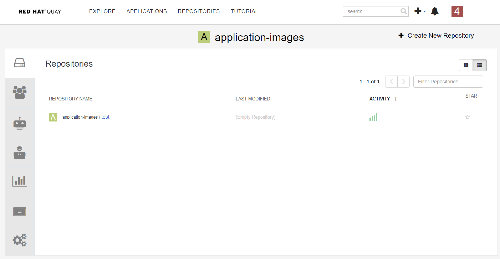

2. Copy Images from Public Red Hat Registry to Quay via Skopeo
```bash
$ sudo docker login quay-eu-uat
$ sudo skopeo copy --src-tls-verify=false --dest-tls-verify=false docker://registry.redhat.io/rhscl/nginx-116-rhel7 docker://quay-eu-uat/application-images/test:1
```

3. Check the vulnerability scan result
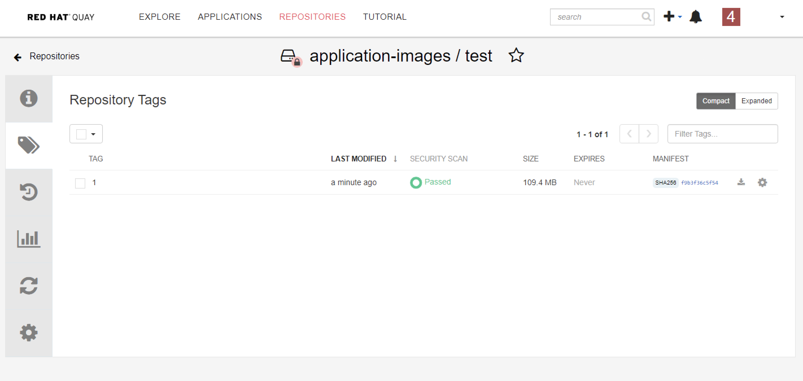

Robot Account Introduce
-------------------------

There are many circumstances where permissions for repositories need to be shared with other services, such as CI/CD pipeline and Openshift. To support this case, Quay allows the use of robot account which is owned by a user or organization to access multiple repositories.

1. Create a robot account
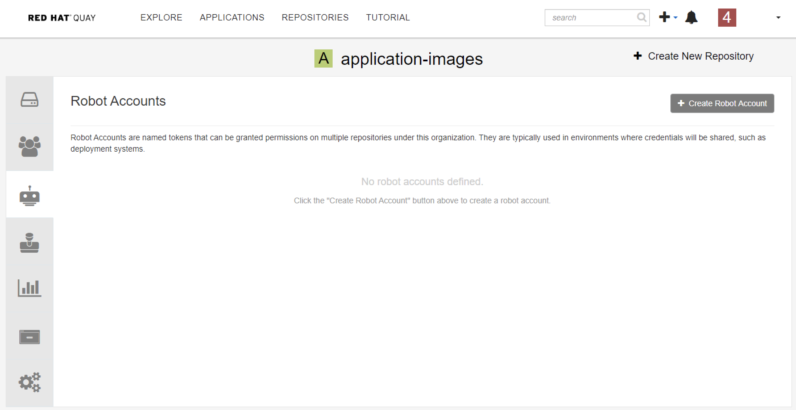

2. Give the robot account a name
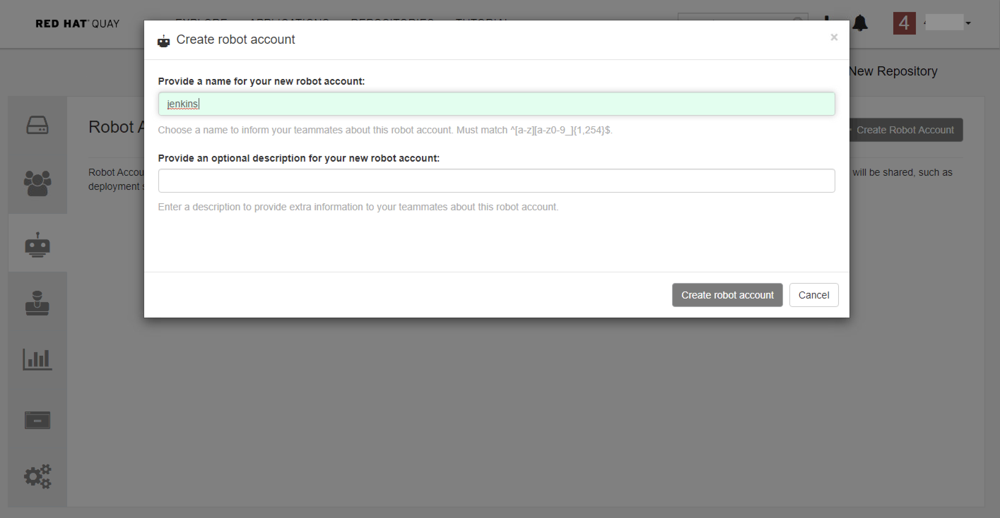

3. Give robot account permission to access your repository
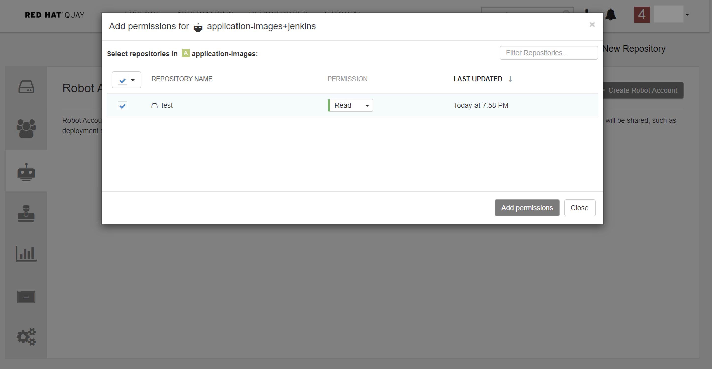

4. Get the credential of the robot account.
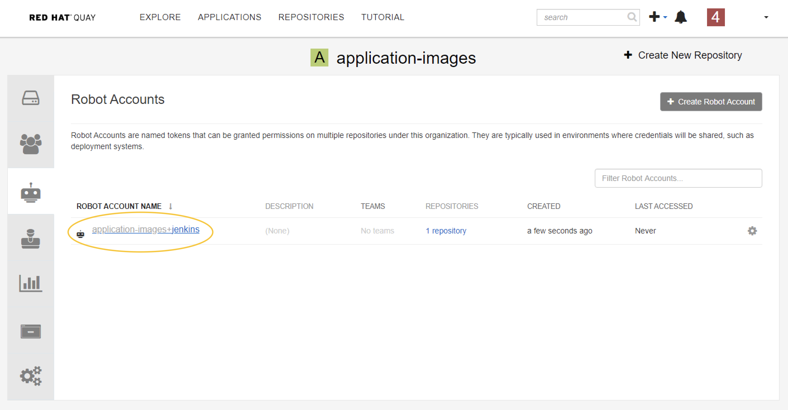
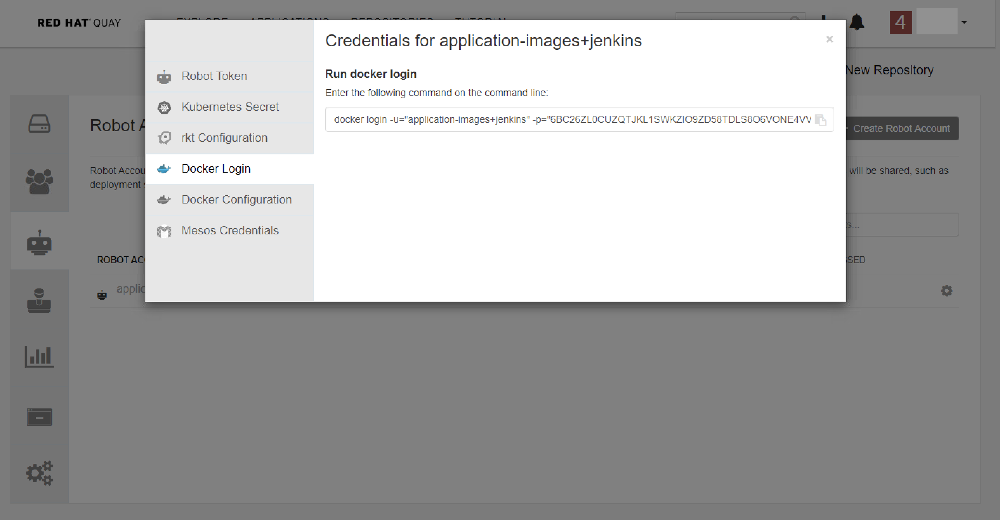

5. Logging in with a robot account on other Server

```bash
$ docker login -u="application-images+jenkins" -p="6BC26ZL0CUZQTJKL1SWKZIO9ZD58TDLS8O6VONE4VVNF9M1ZQGGMCVBXORNC0BNG" quay-eu-uat
```

6. Make sure you can pull images with this robot account

```bash
$ docker pull quay-eu-uat/application-images/test:1
```

Tag Expiration
-------------

The Tag Expiration is a very useful feature when you just want to build and push some images for temporary testing. Tag expiration can be set in two ways:

- Setting tag expiration from a Dockerfile
Adding a label like ``quay.expires-after=20h`` via the Dockerfile LABEL command will cause a tag to automatically expire after the time indicated. The time values could be something like 1h, 2d, 3w for hours, days, and weeks, respectively, from the time the image is built.

- Setting tag expiration from the repository
On the Repository Tag page there is a UI column titled EXPIRES that indicates when a tag will expire. Users can set this by clicking on the time that it will expire or by clicking the Settings button (gear icon) on the right and choosing Change Expiration.


Mirror Repository
-----------------

If you have multiple distinct Quay servers on different regions, or you want to synchronize the latest official images from DockerHub or Red Hat Registry to your local private registry, the mirror repository feature is for you.

To mirror an external repository from an external container registry, do the following:

1. Create a robot account to pull images for the mirrored repository:

2. Select Create New Repository and give it a name.

3. Select the Settings button and change the repository state to MIRROR.
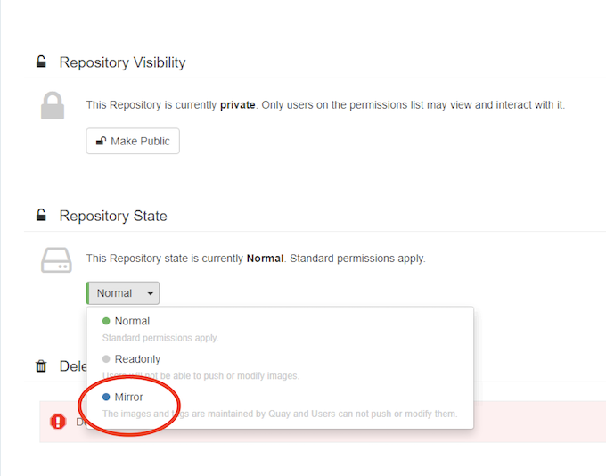

4. Open the new repository and select the Mirroring button in the left column. Fill in the fields to identify the repository you are mirroring in your new repository.
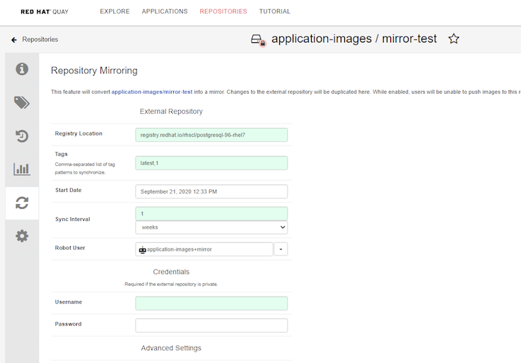

    - Registry URL: Location of the container registry you want to mirror from.
    - Tags: This field is required. You may enter a comma-separated list of individual tags (1-1,1-2,latest) or tag patterns (1-*). At least one Tag must be explicitly entered (ie. not a tag pattern) or the tag "latest" must exist in the remote repository.
    - Sync Interval: Defaults to syncing every 24 hours. You can change that based on hours or days.
    - Robot User: Select the robot account you created earlier to do the mirroring.
    - Username: The username for logging into the external registry holding the repository you are mirroring.
    - Password: The password associated with the Username. Note that the password cannot include characters that require an escape character (\).
    - Start Date: The date on which mirroring begins. The current date and time used by default.
    - Verify TLS: Check this box if you want to verify the authenticity of the external registry. Uncheck this box if, for example, you set up Red Hat Quay for testing with a self-signed certificate or no certificate.
    - HTTP Proxy: Identify the proxy server needed to access the remote site, if one is required.


5. Check the synchronization status from ``Usage Logs``<BR>
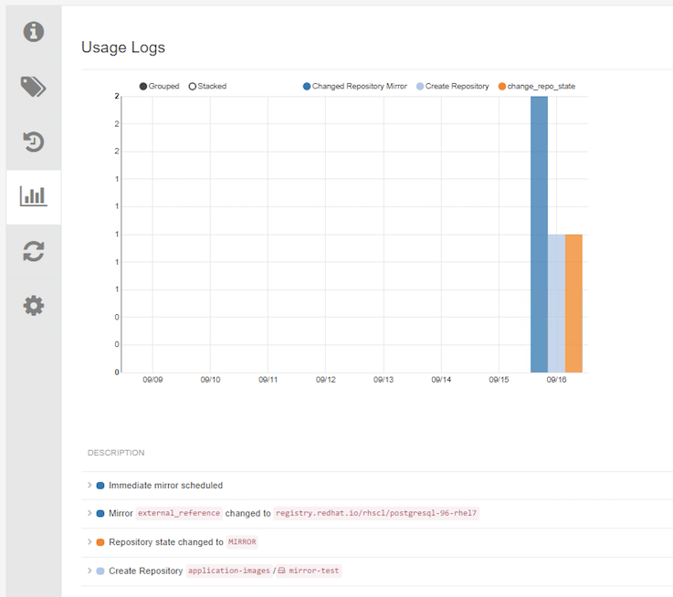

Notification
------------

Quay supports adding notifications to a repository for various events that occur in the repository’s lifecycle. It is a pretty useful feature that can notify users or call CI/CD pipeline when some events happen.

Quay support notification for the following events:

- Repository Push: A successful push of one or more images was made to the repository.
- Vulnerability Detected: A new vulnerability was detected in the exist images.

When an event happen, you can use the following methods to notify users:

- E-mail: An e-mail will be sent to the specified address describing the event that occurred.
- Flowdock Notification: Posts a message to Flowdock.
- Hipchat Notification: Posts a message to HipChat.
- Slack Notification: Posts a message to Slack.
- Webhook POST: An HTTP POST call will be made to the specified URL with the event’s data. This method can be used to trigger CI/CD Pipeline for some automation.

Oauth Application
----------------

Red Hat Quay offers programmatic access via an OAuth 2 compatible API. It is very useful when you want to do some automation to set up and manage Quay, such as set up ``Mirror-Repository`` or ``Notification`` automatically. Generation of an OAuth access token must normally be done via either an OAuth web approval flow, or via the Generate Token tab in the Application settings with Quay's UI.

1. Create a new Oauth Application
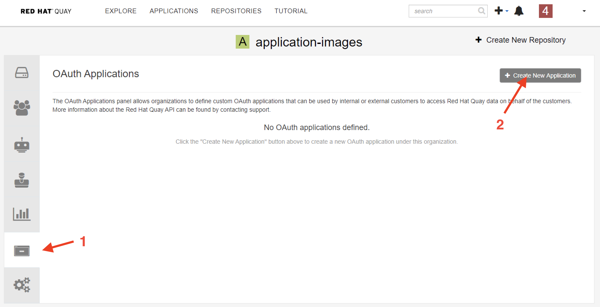

2. Create access token
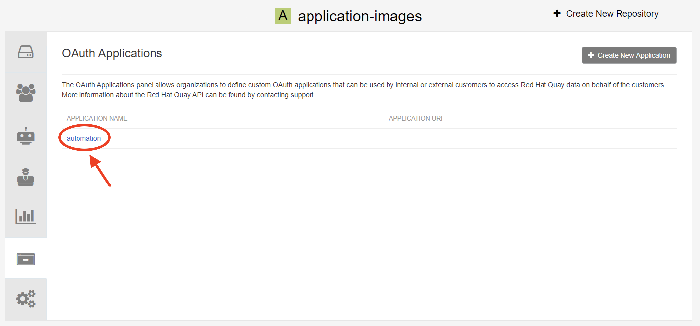

3. Assign appropriate permission to this access token
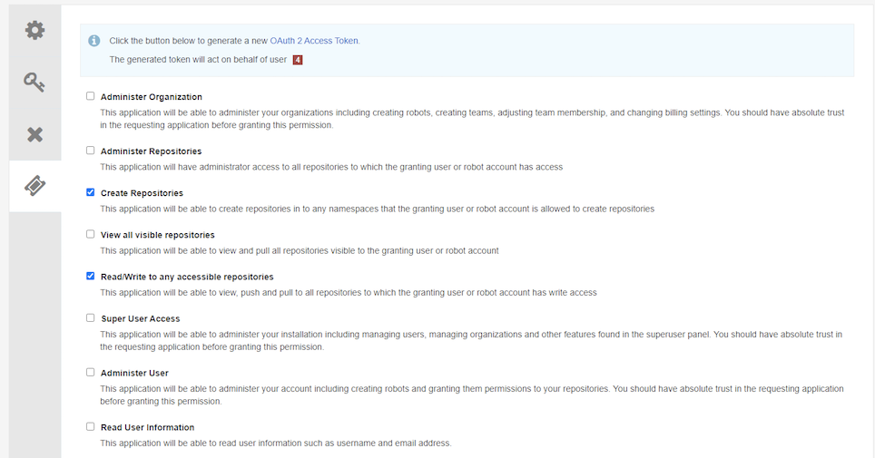

4. Obtain the access token, it will show only once.<BR>
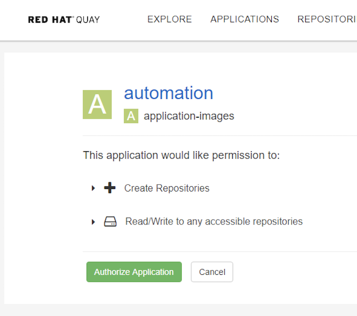
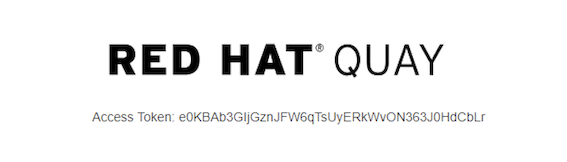

5. Use the access token to access Quay API. You can refer https://docs.quay.io/api/swagger/ to check the Quay API usage. for example:
```bash
curl -s -X GET -k https://quay-eu-uat/api/v1/repository/${QUAY_REPO}/image/${IMAGE_ID}/security?vulnerabilities=true -H "Authorization: Bearer ${QUAY_ACCESS_TOKEN}" -H "Content-Type: application/json"
```

Conclusion
-----------

There is another similar and popular project - [Harbor](https://github.com/goharbor/harbor). It is an open-source registry project and hosted by the Cloud Native Computing Foundation (CNCF). There are not much differences between Quay and Harbor. As a private images registries solution, both Quay and Harbor support many useful functionalities for daily usage.

Darumatic has set up both solutions for different clients according to their requirements. If you are planning to run containers on OpenShift, I would recommend you using Quay, because it is supported by Red Hat and highly integrated with OpenShift.
