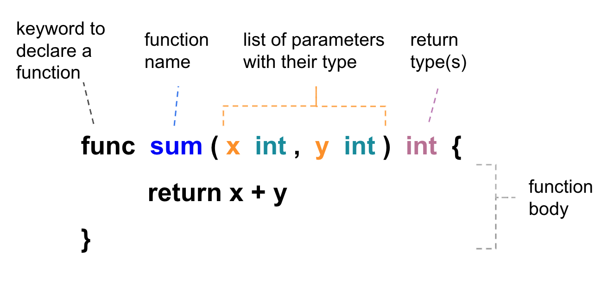

Declairing Functions
-------------------------

We can use the `func` keyword to declair a function as following: 




The input parameters and return type(s) are optional, such as `func main()`. Besides, a function can return multiple values as well. For example:

```go
package main

import (
	"errors"
	"fmt"
)

func main() {
	hello()

	rate, _ := getRate(53, 100)
	fmt.Println(rate, "%")
}

func hello() {
	fmt.Println("Hello world")
}

func getRate(numerator int, denominator int) (float64, error) {
	if denominator <= 0 {
		err := errors.New("denominator cannot be zero or negative")
		return 0.0, err
	}

	rate := float64(numerator) / float64(denominator) * 100
	return rate, nil
}
```


On above example, we return an `error` type value to indicate an abnormal situation and use blank identifier `_` to ignore some of the results from a function that returns multiple values.


We can put functions to another go file as well. For example:

utils.go

```go
package main

import "fmt"

func hello() {
	fmt.Println("Hello world")
}

```

main.go

```go
package main

func main() {
	hello()
}

```

Then you can run command "go run *.go" to test the result

```bash
$ go run *.go
Hello world

```

Be Aware Of Slices Type Parameter.
----------------------------------

As we mention in previous blog, slice is pass by reference.
When you change the value of a slice type parameter inside the function,
The value outside the function is changed as well.

for example:

```go
package main

import "fmt"

func main() {

	x := [5]int{5, 4, 3, 2, 1}
	y := []int{5, 4, 3, 2, 1}
	reset(x, y)
	fmt.Println(x) //output = [5 4 3 2 1]
	fmt.Println(y) //output = [0 4 3 2 1]
}

func reset(a [5]int, s []int) {
	a[0] = 0
	s[0] = 0
}

```