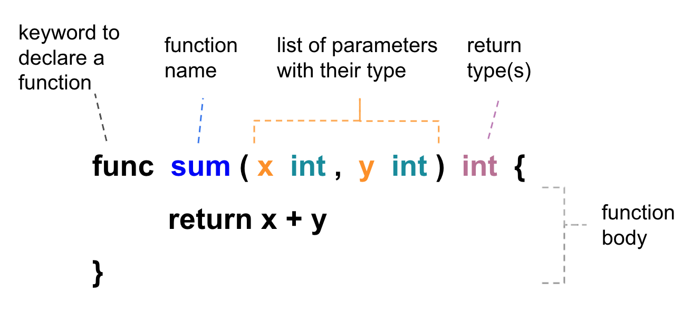

Introduction of Function
-------------------------

We can use the `func` keyword to declair a function as following: 




The input parameters and return type(s) are optional, such as `func main()`. Besides, a function can return multiple values as well. For example:

```go
package main

import (
	"errors"
	"fmt"
)

func main() {
	hello()

	rate, _ := getRate(53, 100)
	fmt.Println(rate, "%")
}

func hello() {
	fmt.Println("Hello world")
}

func getRate(numerator int, denominator int) (float64, error) {
	if denominator <= 0 {
		err := errors.New("denominator cannot be zero or negative")
		return 0.0, err
	}

	rate := float64(numerator) / float64(denominator) * 100
	return rate, nil
}
```


On above example, we return an `error` type value to indicate an abnormal situation and use blank identifier `_` to ignore some of the results from a function that returns multiple values.


Custom Type Declarations
--------

GO apporach instead of Object Orient approach