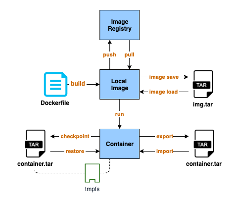

Introduction
-------------

As you may have noticed, Red Hat replaced the Docker Daemon with CRI-O/Podman since RHEL 8.
So what is Podman? According to the definition at [Podman official website](https://podman.io/),

> Podman is a daemonless container engine for developing, managing, and running OCI Containers on your Linux System. Containers can either be run as root or in rootless mode.

Why does Red Hat want to get rid of the Docker Daemon? This is because there are few problems with running Docker with Docker Daemon

- Single point of failure issue, once the daemon died, all containers died.
- This daemon process owned all the child processes for the running containers.
- All Docker operations had to be conducted by a user with the same full root authority.
- Building containers could lead to security vulnerabilities.

So Podman solves the above issues by directly interacting with Image registry, containers and image storage instead of work through a daemon. And the rootless mode allows a user to run containers without the full root authority.
Besides, it also provides a Docker compatible command-line experience enabling users to pull, build, push and run containers.


#### Docker vs Podman


Podman interacts with Linux kernel to manage containers through the runC container runtime process instead of a daemon
. The [buildah](https://buildah.io/)  utility is used to replace Docker build as the container images build tool and Docker push is replaced by [skopeo](https://github.com/containers/skopeo) for moving container images between registries and container engines.


Installation and Setup
------------------------

For RHEL7, subscribe rhel-7-server-extras-rpms yum repository and then enable Extras channel and install Podman.

```
sudo subscription-manager repos --enable=rhel-7-server-extras-rpms
sudo yum-config-manager --enable rhel-7-server-extras-rpms
sudo yum -y install podman
```

#### Rootless mode?
Podman supports rootless mode, for more details to set up rootless mode on Redhat 7, please refer:
https://www.redhat.com/en/blog/preview-running-containers-without-root-rhel-76

This article will focus on the basic usage of Podman.

Basic Usage
------------

Most Podman commands are similar to Docker commands. If you have used the Docker CLI, you will be quite familiar with Podman.

```bash
# Pull mage
sudo podman pull nginx

# List images
sudo podman images

# Run container
sudo podman run -dt -p 8081:80/tcp -v /opt/http:/usr/share/nginx/html:ro --name hello-nginx nginx
```


Checkpoint and Restore
------------------------



If you are running containers with [tmpfs volume](https://docs.docker.com/storage/tmpfs/), then export/import can not be the backup solution for that container because `export` does not back up the memory content. The files in the tmpfs volume will be lost when you `import` the container from the tar file. You can use instead `checkpoint/restore`. For Docker, you will need to turn on 'experimental features to enable this. Podman can use these features directly without doing any change.

#### Run container that supports checkpoint

The `criu` package is required to do checkpoint/restore. And you have to add --security-opt="seccomp=unconfined" when running a container on RHEL because CRIU cannot correctly handle seccomp on RHEL7.

```
sudo yum install -y criu
sudo podman run -dt --tmpfs /tmp -v /opt/http:/usr/share/nginx/html --security-opt="seccomp=unconfined" --name hello-nginx nginx
```

#### Create file in /tmp/ folder
```
sudo podman exec -it hello-nginx touch /tmp/test-01
```

#### Create checkpoint and export as a file.
```
sudo podman container checkpoint --leave-running --export=/tmp/backup.tar hello-nginx
```

#### Restore from file
```
sudo podman stop hello-nginx
sudo podman rm hello-nginx
sudo podman container restore --import=/tmp/backup.tar
```

#### Verify data does not lost in /tmp/ folder

```
$ sudo podman exec -it hello-nginx ls /tmp/test-01
/tmp/test-01
```


Run Contaier in Pods
-----------------

The Pod concept was introduced by [Kubernetes](https://kubernetes.io/docs/concepts/workloads/pods/pod/). A pod is a group of containers that operate together. Podman uses a similar concept to manage a group of containers on a local server. All containers inside the pod share the same network namespace, so they can easily talk to each other over the localhost without the need to export any extra ports. You can refer to this link [Podman: Managing pods and containers in a local container runtime](https://developers.redhat.com/blog/2019/01/15/podman-managing-containers-pods/) for more technical details about Podman. In this article, we will focus on how to run and manage pods on the local server.

### Create pod manually

The first thing to do is the creation of a new pod.
```
# sudo podman pod create -n my-app -p 8081:80
```

And then add a container to a pod
```
sudo podman run -dt --pod my-app -v /opt/http:/usr/share/nginx/html:ro --security-opt="seccomp=unconfined" --name hello-nginx nginx
```

Notice that you cannot run a container that binds a port to a container that runs in a pod.
You have to bind the port to the pod instead, and there is an issue when you try to export multiple ports in a pod.

You can list all pods by running `podman pod ps`
```
# sudo podman pod ps
POD ID         NAME     STATUS    CREATED          # OF CONTAINERS   INFRA ID
75d943416fc8   my-app   Created   26 minutes ago   1                 30138c8d0d1c
```

If you stop a pod, all containers in the pod will stop as well.
```
$ sudo podman pod stop my-app
a2edfd1095760b1e2946271184743cce6f621665878b618ddc83d73b295070ba
$ sudo podman ps -a
CONTAINER ID  IMAGE                           COMMAND               CREATED        STATUS                    PORTS                 NAMES
cacdc75990b0  docker.io/library/nginx:latest  nginx -g daemon o...  2 minutes ago  Exited (0) 7 seconds ago  0.0.0.0:8082->80/tcp  hello-nginx
4dce350e01cf  k8s.gcr.io/pause:3.1                                  3 minutes ago  Exited (0) 7 seconds ago  0.0.0.0:8082->80/tcp  a2edfd109576-infra
```

Similarly, starting a pod will start all containers in the pod.
```
$ sudo podman pod start my-app
a2edfd1095760b1e2946271184743cce6f621665878b618ddc83d73b295070ba
$ sudo podman ps -a
CONTAINER ID  IMAGE                           COMMAND               CREATED        STATUS            PORTS                 NAMES
cacdc75990b0  docker.io/library/nginx:latest  nginx -g daemon o...  4 minutes ago  Up 5 seconds ago  0.0.0.0:8082->80/tcp  hello-nginx
4dce350e01cf  k8s.gcr.io/pause:3.1
```


### Create Pod by Kubernetes style YAML file.

https://mkdev.me/en/posts/dockerless-part-3-moving-development-environment-to-containers-with-podman

Podman supports setting a pod via Kubernetes-compatible pod definition YAML file.
You can mount a volume by using [hostPath](https://kubernetes.io/docs/concepts/storage/volumes/#hostpath)


```yaml
# my-app.yaml
apiVersion: v1
kind: Pod
metadata:
  name: my-app
spec:
  containers:
  - name: ng1
    image: nginx
    ports:
      - containerPort: 8001
        hostPort: 8001
        protocol: TCP
    volumeMounts:
      - name: html1-volume
        mountPath: /opt/html
      - name: config1-volume
        mountPath: /etc/nginx/conf.d
  - name: ng2
    image: nginx
    ports:
      - containerPort: 8002
        hostPort: 8002
        protocol: TCP
    volumeMounts:
      - name: html2-volume
        mountPath: /opt/html
      - name: config2-volume
        mountPath: /etc/nginx/conf.d
  volumes:
    - name: html1-volume
      hostPath:
        path: /opt/myapp/html1
        type: Directory
    - name: config1-volume
      hostPath:
        path: /opt/myapp/config1
        type: Directory
    - name: html2-volume
      hostPath:
        path: /opt/myapp/html2
        type: Directory
    - name: config2-volume
      hostPath:
        path: /opt/myapp/config2
        type: Directory
```

To create a new pod with YAML file
```
$ sudo podman play kube ./my-app.yaml
```


Check all containers are running
```
$ podman ps -a
CONTAINER ID  IMAGE                           COMMAND               CREATED        STATUS                        PORTS                             NAMES
2268e5ab9b61  nginx                           nginx -g daemon o...  2 minutes ago  Up 2 minutes ago              0.0.0.0:8001-8002->8001-8002/tcp  ng2
19dba831eeae  nginx                           nginx -g daemon o...  2 minutes ago  Up 2 minutes ago              0.0.0.0:8001-8002->8001-8002/tcp  ng1
42c150972ddb  k8s.gcr.io/pause:3.1                                  2 minutes ago  Up 2 minutes ago              0.0.0.0:8001-8002->8001-8002/tcp  4ae6b24effb5-infra
```

> Notice that all the containers in a pod will share the same local IP 127.0.0.1. They must be running on different ports, otherwise, some container will fail to start due to the port conflict.


Conclusion
-----------

As the replacement of Docker, Podman provides the same developer experience as Docker while doing things in a slightly more secure way in the background. You could alias Docker with Podman and never notice that there is a completely different tool for managing your local containers. Besides, with the daemonless design and the rootless mode, Podman is more isolated and secure than Docker. You should consider using Podman instead of installing Docker-ce on your local machine.


The ability for Podman to handle Kubernetes-compatible pod deployment is a clear differentiator to other container runtimes. For the Kubernetes users, they should be comfortable implementing the YAML file to manage a group of containers locally.

However, compared to docker-compose, Podman Pod can not be used to build multiple images at the same time. There is a third-party tool [podman-compose](https://github.com/muayyad-alsadi/podman-compose) that might offer this functionality, but I would suggest implementing a script for building images and use Podman Pod for containers management.
