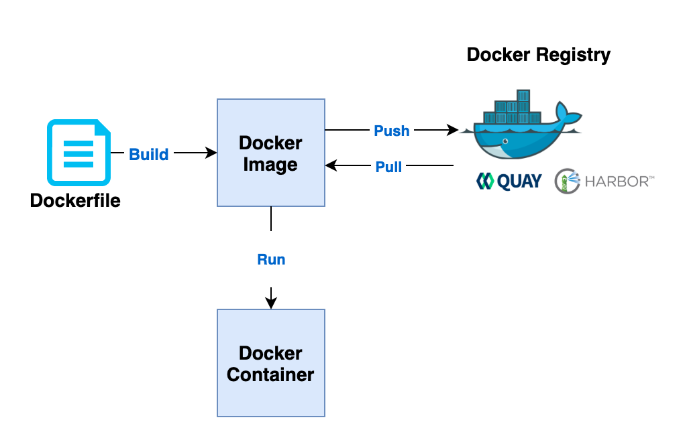

## Container vs VM

[]()

The container’s system requires an underlying operating system that provides the basic services to all of the containerized applications using virtual-memory support for isolation. 


## Container Concept

[]()


[]()


### Standard Shell script to run container on VM

```
#!/bin/bash

data_folder="/opt/postgresql"
pgsql_user="myadmin"
pgsql_password="myPassword"
pgsql_database="myapp"


mkdir -p ${data_folder}
chmod 777 ${data_folder}

docker run -d --name postgresql \
-v "${data_folder}:/var/lib/pgsql/data:Z" \
-p "5432:5432" \
-e POSTGRESQL_USER="${pgsql_user}" \
-e POSTGRESQL_PASSWORD="${pgsql_password}" \
-e POSTGRESQL_DATABASE="${pgsql_database}" postgresql-10-rhel7:1-42
```


### Volumes

Volume is used for persisting data generated by and used by Docker containers.
Use -v/--volume flag to mount the host folder into container.

Notice:
Make sure the user inside container has permission to access the mounted host folder
Two ways:
(1) chown -R "uid:gid" /host_folder (recommend)
(2) chmod -R 777 /host_folder

more details:

https://docs.docker.com/storage/volumes/
http://www.projectatomic.io/blog/2015/06/using-volumes-with-docker-can-cause-problems-with-selinux/


### Expose and Publish

The EXPOSE instruction in Dockerfile informs Docker that the container listens on the specified network ports at runtime.

```
EXPOSE 5432/tcp
```

If you EXPOSE a port, the service in the container is not accessible from outside Docker, but from inside other Docker containers.
Use the -p flag to actually publish the port, the service in the container is accessible from anywhere, even outside Docker.

```
docker run -p "5432:5432" ...
docker run -p "127.0.0.1:8080:80
```


### Environment Variables

Use the -e, or --env-file flags to set simple (non-array) environment variables in the container,
or overwrite variables that are defined in the Dockerfile of the image you’re running.


```
docker run \
-e TZ="${cluster_timezone}" \
-e POSTGRESQL_USER="${pgsql_user}" \
-e POSTGRESQL_PASSWORD="${pgsql_password}" \
-e POSTGRESQL_DATABASE="${pgsql_database}" \
...
```


### ENTRYPOINT & CMD

Why set up environment variables can create the database?  -> ENTRYPOINT and CMD


ENTRYPOINT is used to identify which executable should be run when a container is started
The CMD is run via the entrypoint.

If ENTRYPOINT is not specify, the default entrypoint is "/bin/sh -c" or "exec"


```
# exec form, preferred
CMD ["executable","param1","param2"]

# shell form, the <command> will execute in /bin/sh -c
CMD command param1 param2
```

If you would like your container to run the same executable every time,
then you should consider using ENTRYPOINT in combination with CMD

ENTRYPOINT /my_container_entrypoint.sh
CMD ["param1", "param2"]

Please refer https://docs.docker.com/engine/reference/builder/#entrypoint


### Docker Exec 


The docker exec command runs a new command in a running container. We could use this command to get into a running the container and check the files and service status inside the container

```
docker exec -it postgresql bash
```

### Dockerfile


```
FROM nodejs-8:8.16.1-1-local
ARG NPM_TOKEN


COPY . /usr/src/app
WORKDIR /usr/src/app

RUN echo -e "email=devops@test.local \n \
always-auth=true \n \
strict-ssl=false \n \
_auth='$NPM_TOKEN' \n \
registry=https://nexus.local/nexus/repository/npm-registry/ \n" \
>> /usr/src/app/.npmrc

RUN cat /usr/src/app/.npmrc
RUN npm install && \
    rm -f .npmrc

RUN chown -R "1001:0" /usr/src/app
RUN chmod -R u+w /usr/src/app
RUN mkdir -p /usr/logs && chown -R "1001:0" /usr/logs && chmod -R u+w /usr/logs

USER 1001

EXPOSE 8000

CMD ["node","hello-http.js"]
```


### Build docker images with build argument

```
docker build --build-arg NPM_TOKEN=xxxxxxxxxxxxxxxxxxxxxxxxxx -t my-demo-app:0.1.0 .
```


> **Tips:** What is the entrypoint?
> ```
> sudo docker inspect my-demo-app:0.1.0
> ```


> **Tips:** What is the different of COPY and ADD?
>
> COPY only supports the basic copying of local files into the container, while ADD has some features (like local-only tar extraction and remote URL support)
> For other items (files, directories) that do not require ADD’s tar auto-extraction capability, you should always use COPY.
> Using ADD to fetch packages/files from remote URLs is discouraged; you should use curl or wget
>
>```
> ADD http://example.com/font.js /opt/
> ADD my_big_lib.tar.gz /var/lib/myapp
>```


### Run Container for debugging

```
docker run -it <IMAGE> sh
```


