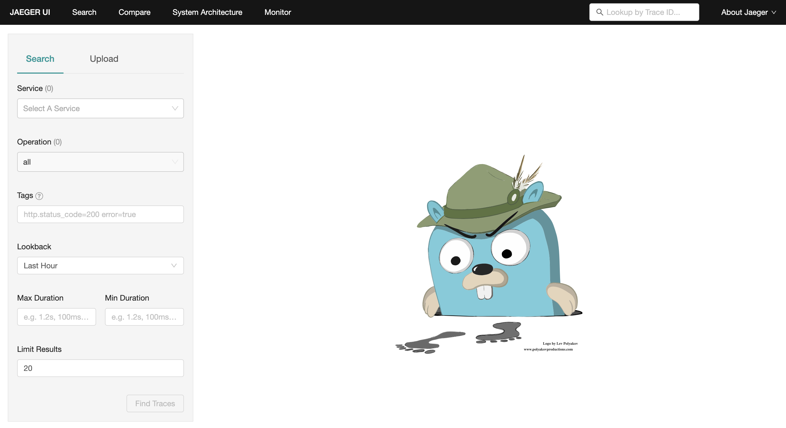
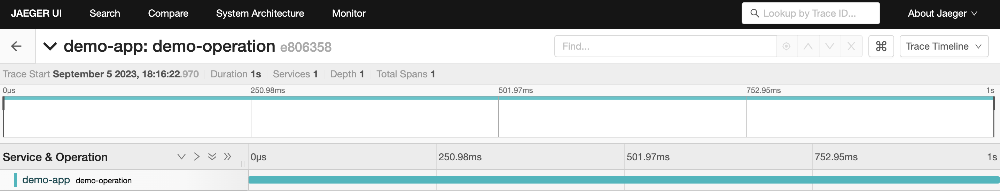

In this guide, we will explore how to manually instrument a Python application to export traces to Jaeger using OpenTelemetry.

Configure Jaeger as OpenTelemetry Backend
----------------------------------------------------------------

Before we dive into instrumentation, we need a backend instance to send our traces to.
And Jaeger is an open-source, popular distributed tracing system that can helps users to monitor and troubleshoot transactions in complex, microservices-based architectures. With Jaeger, we can trace the path of a request as it moves through various services, measure latency, and gain valuable insights into the performance of the application from the fancy UI.

Jaeger can run on local environment using Docker or deployed on Kubernetes.
In the article, we will set up Jaeger locally.

Step 1, Install Docker: If you don't already have Docker installed, download and install it from the official website.

Step 2, Run Jaeger All-in-One: Open your terminal and run the following command to start a local Jaeger instance:

```bash
docker run -d --rm --name jaeger \
  -e COLLECTOR_ZIPKIN_HOST_PORT=:9411 \
  -p 6831:6831/udp \
  -p 6832:6832/udp \
  -p 5778:5778 \
  -p 16686:16686 \
  -p 4317:4317 \
  -p 4318:4318 \
  -p 14250:14250 \
  -p 14268:14268 \
  -p 14269:14269 \
  -p 9411:9411 \
  jaegertracing/all-in-one:latest
```

The container exposes the following ports:

| Port  | Protocol | Component | Function                                          |
| ----- | -------- | --------- | ------------------------------------------------- |
| 6831  | UDP      | agent     | accept jaeger.thrift over compact thrift protocol |
| 6832  | UDP      | agent     | accept jaeger.thrift over binary thrift protocol  |
| 5778  | HTTP     | agent     | serve configs                                     |
| 16686 | HTTP     | query     | serve frontend                                    |
| 14268 | HTTP     | collector | accept jaeger.thrift directly from clients        |


Step 3, Access the Jaeger UI: Open your web browser and go to http://localhost:16686 to access the Jaeger UI.




You now have a local Jaeger instance running and ready to receive traces.

Preparing the Demo Environment and OpenTelemetry SDK
--------------------------------


Let's create a Python project directory for our demo

1. Create a Directory: Open your terminal and create a new directory for your project.

```bash
mkdir -p opentelemetry/jaeger-manual
cd opentelemetry/jaeger-manual
```

2. Set Up a Virtual Environment: Create a virtual environment to isolate your project's dependencies.

```bash
python3 -m venv venv
source venv/bin/activate  # On Windows, use 'venv\Scripts\activate'
```

3. Install Required Packages: Install the necessary packages for our demo.

```bash
python3 -m pip install --upgrade --no-cache pip
python3 -m pip install --no-cache opentelemetry-api opentelemetry-sdk opentelemetry-exporter-jaeger
```


Manually Generating a Single-Span Trace
-------------------------------------------

Now, let's write some Python code to manually instrument our application and generate a single-span trace. This will give you a practical understanding of how OpenTelemetry works.

```python
import time
from opentelemetry import trace
from opentelemetry.exporter.jaeger.thrift import JaegerExporter
from opentelemetry.sdk.resources import Resource
from opentelemetry.sdk.trace import TracerProvider
from opentelemetry.sdk.trace.export import BatchSpanProcessor


# Create a tracer provider
tracer_provider = TracerProvider(
    resource=Resource.create({"service.name": "demo-app"}))

# Create a Jaeger exporter
jaeger_exporter = JaegerExporter(
    agent_host_name="localhost",
    agent_port=6831,
)

# Create a batch span processor and add the Jaeger exporter
span_processor = BatchSpanProcessor(jaeger_exporter)
tracer_provider.add_span_processor(span_processor)

# Set the tracer provider as the global tracer provider
trace.set_tracer_provider(tracer_provider)

# Get a tracer
tracer = trace.get_tracer(__name__)

# Define a function to create and record a span
def perform_operation():
    with tracer.start_as_current_span("demo-operation"):
        print("Performing some operation...")
        time.sleep(1)


# Call our function
perform_operation()

# Gracefully shutdown the exporter and span processor
span_processor.shutdown()

```

In this code:

- We create a tracer provider and a Jaeger exporter.
- We define a function (perform_operation) that creates and records a span.
- The span is sent to our local Jaeger instance for visualization.

Explore Trace Data in Jaeger
-------------------------

1. Run the Demo Code: In your project directory, run the Python script to export trace data to Jaeger

```bash
python3 demo.py
```

2. Access the Jaeger UI: Open your web browser and go to http://localhost:16686 to access the Jaeger UI.

3. View Your Trace: In the Jaeger UI, you should see a trace generated by our demo application. You can explore various details of the trace, including the span's name, duration, and more.





Conclution
----------

Today, we have demonstrated that the usage of OpenTelemetry python SDK to manually instrument a trace and export the trace to Jaeger for analysis.
Next, we will examine that how to use do automatic instrumentation without updating our code base using Python falmework - flask.

Reference
-------

https://opentelemetry.io/docs/instrumentation/python/getting-started/
https://opentelemetry.io/docs/specs/otel/trace/sdk_exporters/jaeger/
[](https://medium.com/jaegertracing/introducing-native-support-for-opentelemetry-in-jaeger-eb661be8183c)