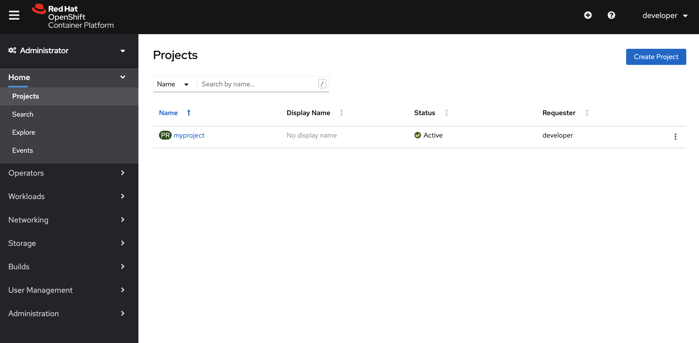
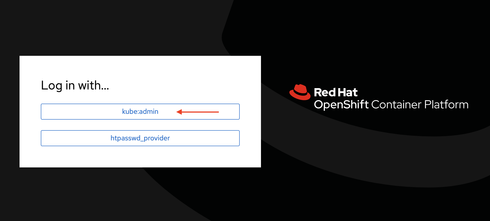
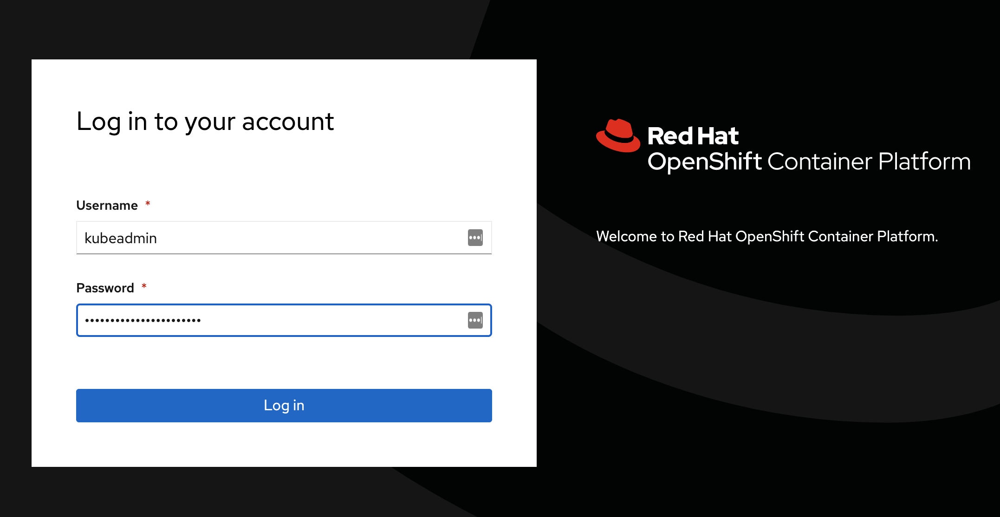
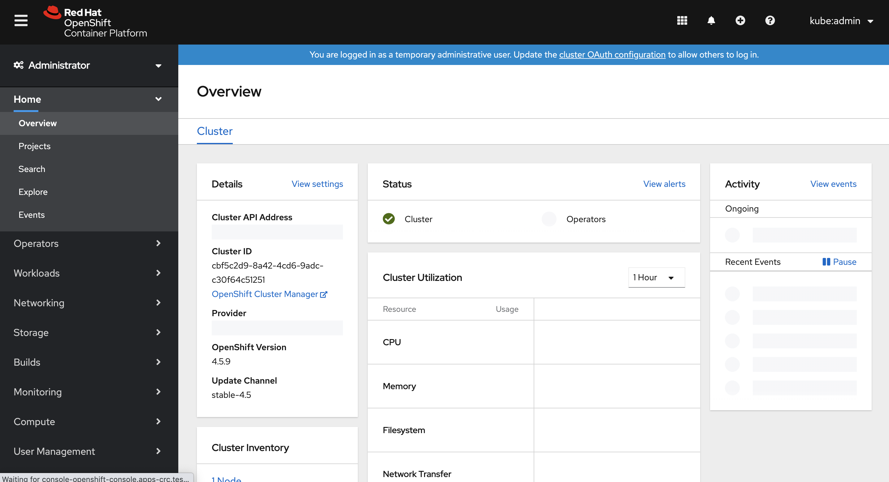

From Kubernetes to OpenShift
---------------------

Although Kubernetes has became the most widely used orchestration platform nowadays, there is still a huge lack of enterprise solutions for the large-scale companies which care the security and durability much more than portability and flexibility. That is where Red Hat OpenShift comes in.

There are 3 benefits to show why OpenShift overweight Kubernetes.

1. OpenShift integrated some useful features, such as Promotheus, Grafana and Ingress (also cal Route in Openshift). The components are required to maintain the enterprise-level platform, while Kubernetes needs to set up these add-on manually.

2. OpenShift has stricter security policies than the Kubernetes. For example, it is straightforward for people to deploy an application which run a container as root on Kubernetes, but the security policies of OpenShift restrict them to do so. With the policies of OpenShift, users have no choice but learn the security policies to deploy their applications.

3. OpenShift provides Web-based User Interface (UI) to visualize nodes, projects, and cluster resources so that cluster admin can manage clusters more effective. Besides, the web console has a login page. It is much eaiser for user to access the cluster and start their journey.

Install and Try OpenShift 4 on Mac via Red Hat CodeReady Containers
--------------------------------------------------------------------------


**Prerequisites:**

CodeReady Containers requires the following minimum system resources to run Red Hat OpenShift:

- 4 virtual CPUs (vCPUs)
- 8 GB of memory
- 35 GB of storage space

You will also require the native hypervisor for your host operating system.
CodeReady Containers currently supports libvirt for Linux, HyperKit for macOS, and Hyper-V for Windows.


1. Install hyperkit

```
$ brew install hyperkit
$ brew link --overwrite hyperkit
```

2. download CodeReady Containers

Download CodeReady Containers archive from the [Red Hat CodeReady Containers product page](the Red Hat CodeReady Containers product page)

3. extract the CodeReady Containers archive for your operating system and place the binary in your $PATH

```
$ cp crc /usr/local/bin/
```

4. setup cluster
Once CodeReady Containers has been installed, set up your host environment with the `crc setup`command. This command must be run before starting the OpenShift cluster.


5. Start your OpenShift 4.x cluster

After your host environment has been set up with the crc setup command, you can start the OpenShift cluster with the `crc start` command.

When prompted, supply your user pull secret for the cluster. Your user pull secret can be copied or downloaded from the the Red Hat CodeReady Containers product page under the Pull Secret section. A Red Hat account is required to access the user pull secret.

When start process finished, it will show the user credentials that you can use to login OpenShift


1. Using your cluster

To access the cluster, first set up your environment by following `crc oc-env` instructions.

```
$ Brandons-MacBook-Pro:crc-macos-1.16.0-amd64 brandon$ crc oc-env
export PATH="/Users/brandon/.crc/bin/oc:$PATH"
# Run this command to configure your shell:
# eval $(crc oc-env)
```

login OpenShift as developer

```
$ oc login -u developer -p developer https://api.crc.testing:6443
Login successful.

You don't have any projects. You can try to create a new project, by running

    oc new-project <projectname>
```


Create your first project/namespace.

```
$ oc new-project myproject
```

> A `project` is a Kubernetes `namespace` with additional annotations, and is the central vehicle by which access to resources for regular users is managed. A project allows a community of users to organize and manage their content in isolation from other communities. Users must be given access to projects by administrators, or if allowed to create projects, automatically have access to their own projects.
> Unlike Kubernetes, A normal user can not create pods in the default project/namespace. You must create the first project before appling the new pod.


list all projects/namespaces

```
$ oc projects
You have one project on this server: "myproject".

Using project "myproject" on server "https://api.crc.testing:6443".
```

In Kebernetes, you need to install plugin `kubens` to switch between namespaces. However, this is build-in feature in OpenShift, you just need to run `oc project <my-project>`.


Switch to different project/namespace

```
$ oc project myproject
Already on project "myproject" on server "https://api.crc.testing:6443".
```


6. Access the Web Console

You can now run `crc console` and use these credentials to access the OpenShift web console.

6.1 login as "Developer"

choose "htpasswd_provider"


Input developer password


Check the Web concole for developer




6.1 login as "kubeadmin"

choose "kube:admin"



Input admin password




Check the Web concole for admin




1. Stop cluster

```
$ crc stop
```

8. Check cluster status

```
$ crc status
CRC VM:          Stopped
OpenShift:       Stopped
Disk Usage:      0B of 0B (Inside the CRC VM)
Cache Usage:     13.05GB
Cache Directory: /Users/brandon/.crc/cache
```


Conclusion
----------

Since Kubernetes forms the base of OpenShift, one can find a lot of common aspects between the two.  While Kubernetes remains a container platform, OpenShift comes into being and keeps a tab on the needs of different enterprises.

Kubernetes and OpenShift are widespread container management systems, and each has its unique features, benefits, and undoubtedly some drawbacks too. While K8s helps automate application deployment, scaling, and operations, OpenShift is the containerization platform that runs with Kubernetes underneath to help applications run more efficiently. If you are already aware of containerization principles and have some idea about K8s, you would slightly lean towards Kubernetes since it is much more flexible than the OpenShift.

Openshift, even though has an opinionated approach but it is indeed easier for beginners simply because it offers a better CLI and of course a web interface. Beginners would definitely want to have a go at the web interface rather than the CLI. Whereas the dashboard with K8s is not so ideal, considering it doesn’t bring more value to K8s than the command line. It can’t be concluded that the OpenShift has the best web interface available out there,  however it is very useful since it makes things easier for a user, and tell me who doesn’t like EASY!