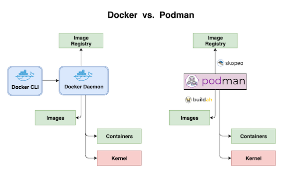

Day 3: Podman 淺談 - 為何你應該選擇 Podman 而不是 Docker？
=======================================================

前言
-----

-----


您可能已經注意到，自 RHEL8 起，Red Hat 用 CRI-O/Podman 取代了 Docker Daemon。
那麼什麼是Podman？根據[Podman官方網站]（https://podman.io/）上的定義，

> Podman是一個無背景程序（ Daemonless ）的容器引擎，用於在Linux系統上開發，管理和運行容器。容器可以以root或非root使用者模式運行。

為什麼 Red Hat 想要擺脫 Docker Daemon？這是因為使用 Docker Daemon 運行 Docker 有以下這些問題

- 單點故障問題，Docker Daemon一旦死亡，所有容器都將死亡。
- Docker Daemon擁有運行中的容器的所有子進程。
- 所有Docker操作都必須由具有跟root相同權限的用戶執行。
- 構建容器時可能會導致安全漏洞。

因此，Podman 通過直接與 Image Registry，Image 和 Container 進行互動而不是通過背景程序來解決上述問題。而且，Podman 允許用戶在沒有完全 root 權限的情況下運行容器。
最棒的是，它還提供了與 Docker 兼容的指令，使用戶可以很輕易的從原本的 Docker 指令切換到 Podman 指定。


Docker vs Podman
----------------

-----





由上圖我們可以看出 Podman 跟 Docker 的差別。Podman 沒有背景程序，它是通過 runC runtime process 直接跟 Linux 核心構通來運行容器（Container）。 [buildah]（https://buildah.io/）用來替代 Docker build。而跟 Image Registry 的溝通則被[skopeo]（https://github.com/containers/skopeo）取代了。


安裝及設定
-----------

-----


在 RHEL7 上, 你必續訂閱並啟動 rhel-7-server-extras-rpms yum repository 才可以安裝 Podman。

```
sudo subscription-manager repos --enable=rhel-7-server-extras-rpms
sudo yum-config-manager --enable rhel-7-server-extras-rpms
sudo yum -y install podman
```

透過 yum 指令安裝的 Podman 仍需要在 root 權限的情況下運行容器，如果要設定 Rootless 模式，請參考這篇[部落格](https://www.redhat.com/en/blog/preview-running-containers-without-root-rhel-76)，本文章僅做基本用途介紹。


指令基本用法
------------

-----


大部分 Podman 指令用法跟 Docker 指令一樣。如果你曾使用過 Docker CLI, 你應該會對 Podman 指令感到非常熟悉。
例如

```bash
# Pull mage
sudo podman pull nginx

# List images
sudo podman images

# Run container
sudo podman run -dt -p 8081:80/tcp -v /opt/http:/usr/share/nginx/html:ro --name hello-nginx nginx
```


備份映像檔及容器
--------------

-----


如圖所示，我們可以使用 ``save/load`` 來備份跟還原映像檔 還可以用 ``export/import``  來備份及導入運行中的容器。但是如果您掛載 [tmpfs volume]（https://docs.docker.com/storage/tmpfs/）在運行的容器，則 ``export/import`` 不能作為該容器的備份解決方案，因為 `export` 不會備份Ｍemory內存檔案。 當您從 tar 文件中導入容器時，tmpfs中的資料將會遺失。此時您可以改用 `checkpoint/restore` 功能。 對於Docker，您需要打開啟動“實驗性功能”才可以使用此指令。而 Podman 可以直接使用這些功能，無需更改任何設定。


雖然 `checkpoint/restore` 看似可以完全取代 ``export/import``，但實際上在 RHEL7 上實驗此功能時仍須做額外的設定才行。 首先你必須安裝 `criu` 套件 而且你必須在運行容器時增加參數 `--security-opt="seccomp=unconfined"`，這是因為 CRIU 在 RHEL7 上目前仍無法正確的處理seccomp設定。 如以下範例：

1. 啟動一個支援的容器

```
sudo yum install -y criu
sudo podman run -dt --tmpfs /tmp -v /opt/http:/usr/share/nginx/html --security-opt="seccomp=unconfined" --name hello-nginx nginx
```

2. 在資料夾夾下建立一個檔案

```
sudo podman exec -it hello-nginx touch /tmp/test-01
```

3. 利用 checkpoint 備份容器

```
sudo podman container checkpoint --leave-running --export=/tmp/backup.tar hello-nginx
```

4. 還原容器

```
sudo podman stop hello-nginx
sudo podman rm hello-nginx
sudo podman container restore --import=/tmp/backup.tar
```

5. 檢查 /tmp/ 資料夾下的容器是否遺失

```
$ sudo podman exec -it hello-nginx ls /tmp/test-01
/tmp/test-01
```

結論
-----

-----


作為 Docker 的替代方案，Podman 提供了與 Docker 相同的開發體驗，同時在後台以更安全的方式處理事務。此外，憑藉無背景程序（ Daemonless ）的設計和無根模式（ Rootless mode ），Podman 顯然比 Docker 更加的安全。 如果你打算在 Red Hat 系統上運行容器，您應該考慮使用 Podman，而不是在本地端安裝 docker-ce。

> 本篇英文版發佈在 https://darumatic.com/blog/podman_introduction