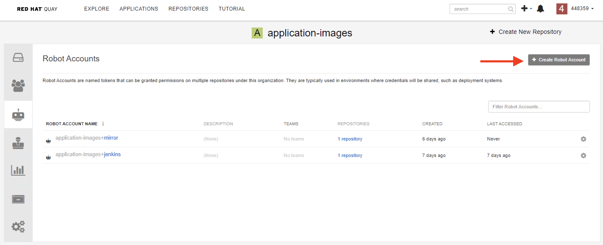
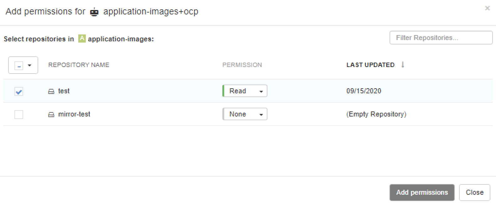
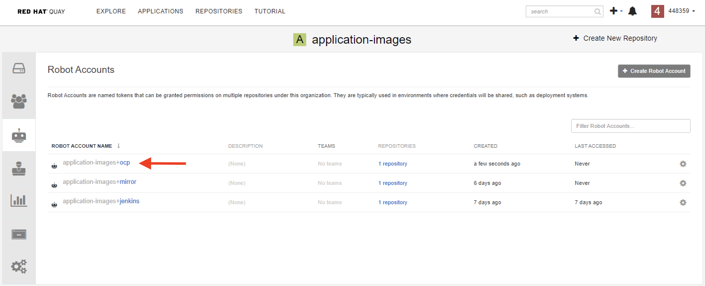
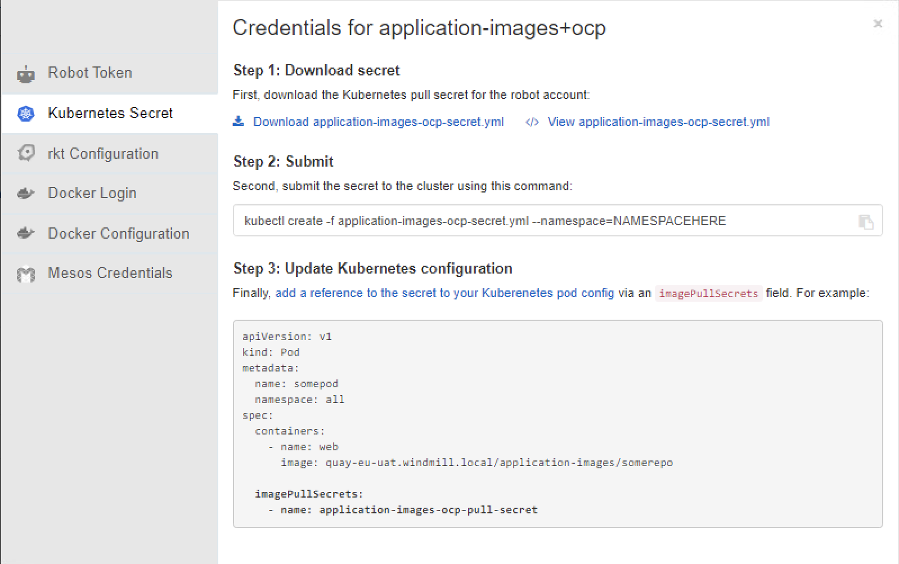

OCP 系列： 裝了OCP就想部署Pod? 沒這麼容易!
========================================


在[前一篇文章](https://ithelp.ithome.com.tw/articles/10243166)中，我們在 Mac 安裝及啟動了 OpenShift。
現在讓我們試著在 [minikube](https://ithelp.ithome.com.tw/articles/10241727) 中使用的同一 YAML 文件來在 OpenShift 創建一個新的 Pod。

```yaml
apiVersion: v1
kind: Pod
metadata:
  name: nginx-pod
  labels:
    app: nginx
spec:
  containers:
  - name: nginx
    image: nginx:1.14.2
    imagePullPolicy: Always
    ports:
    - containerPort: 80
```

以開發者身份登入並部署在 "myproject" 專案。

```
$ oc login -u developer -p developer https://api.crc.testing:6443
Login successful.

$ oc project myproject
Now using project "myproject" on server "https://api.crc.testing:6443".

$ oc apply -f ./test.yaml
pod/nginx-pod created

```

檢查狀態。

```
$ oc get pods
NAME        READY   STATUS             RESTARTS   AGE
nginx-pod   0/1     CrashLoopBackOff   3          81s
```

OOps, 這個 Pod 怎麼會一直 `CrashLoopBackOff` ? 讓我們來看看 logs 說什麼...。

```
$ oc logs nginx-pod
2020/09/22 12:32:45 [warn] 1#1: the "user" directive makes sense only if the master process runs with super-user privileges, ignored in /etc/nginx/nginx.conf:2
nginx: [warn] the "user" directive makes sense only if the master process runs with super-user privileges, ignored in /etc/nginx/nginx.conf:2
2020/09/22 12:32:45 [emerg] 1#1: mkdir() "/var/cache/nginx/client_temp" failed (13: Permission denied)
nginx: [emerg] mkdir() "/var/cache/nginx/client_temp" failed (13: Permission denied)

```

什麼！容器內的使用者有權限問題？ 為何同樣的設定在 Kubernetes 就沒問題，在 ＯpenShift 就不行！？


安全環境限制 （Security Context Constraints）
----------------------------

-----

上述範例會失敗就是因為 OpenShift 的 ``安全環境限制 （Security Context Constraints）`` 導致. 它類似於 RBAC 資源控制用戶訪問的方式，管理員可以使用安全環境限制（Security Context Constraints, SCC）來控制Pod 的權限。 您可以使用 SCC 定義 Pod 運行時必須特定條件才能被系統接受。

ＯpenShifr 包含下列八種 SCCs 設定:

- anyuid
- hostaccess
- hostmount-anyuid
- hostnetwork
- node-exporter
- nonroot
- privileged
- restricted

預設情況下，只有系統管理員，節點和[構建控制器（Build Controller )](https://docs.openshift.com/container-platform/4.5/builds/build-configuration.html) 有 “privileged”的權限。 而其他所有經過身份驗證的用戶則是被授予 “restricted” 的訪問權限。

使用 restricted 的 SCC，Pod 容器內的使用者的ID (UID) 必須在分配的 UID 範圍內。如果容器中預設的使用者的UID不在此範圍內，則OpenShift將選擇一個在該範圍內的UID，然後使用此UID而不是容器中預設的UID來運行容器。 這是因為OpenShift 為了要確保所有 Pod 以非root 使用者的身份運行。


構建客製化映像檔以解決權限問題
--------------------------

-----

一般情況下，OpenShift 使用任意分配且在規定範圍內的 UID 運行容器。 這提供了針對容器引擎（Container Engine ）漏洞額外的安全性。為了支持映像檔以任意分配的UID運行，映像檔中的程式需要存取的目錄和文件都必須歸 "Root Group" 所有，並且可由該 "Root Group" 讀取/寫入。 要執行的文件還應該讓該 "Root Group" 具有執行權限。 因為容器內運行的使用者始終是 "Root Group" 的成員，所以使用者可以讀取和寫入這些文件。 "Root Group" 沒有任何特殊權限（與 Root User 不同），因此此安排沒有安全性問題。

你可以在 Dockerfile 中添加以下範例來設置目錄和文件的存取權限，以允許 "Root Group" 中的用戶在映像中可以存取它們：

```
RUN chgrp -R 0 /some/directory \
  && chmod -R g+rwX /some/directory
```


此外，OpenShift 也不允許用戶在容器中偵聽特定端口，例如 80 或 443 端口。 你應該在容器內監聽端口 8080 或 8443。 當您在 OpenShift 公開對外的Web服務時，外部路由會默認使用端口 80 或 443，並確保將流量通過內部路由導到Web服務器的端口 8080 或 8443。


因此，我們需要修改並客製化 nginx 映像檔，以便在OpenShfit上運行。 如以下範例：

```
FROM nginx:1.14.2


RUN chgrp -R 0 /etc/nginx/ /var/cache/nginx /var/run /var/log/nginx  && \ 
  chmod -R g+rwX /etc/nginx/ /var/cache/nginx /var/run /var/log/nginx

# users are not allowed to listen on priviliged ports
RUN sed -i.bak 's/listen\(.*\)80;/listen 8081;/' /etc/nginx/conf.d/default.conf

# comment user directive as master process is run as user in OpenShift random UID
RUN sed -i.bak 's/^user/#user/' /etc/nginx/nginx.conf

EXPOSE 8080
```

構建映像檔並推送到本地的 Quay。你也可以推送到你自己的 Image Registry。

```
$ docker build -t quay-eu-uat.windmill.local/application-images/test:1 .
$ docker push quay-eu-uat.windmill.local/application-images/test:1
```


在 OpenShift 使用 Quay 上面的映像檔
----------------------

-----

1) 建立機器人帳號（Robot Account）





2) 給他 Read 權限。



3) 取得存取金鑰（Pull Secret）。




4) 部署金鑰到 OpenShift。

```
$ oc apply -f application-images-ocp-secret.yml
```


5) 更新 YAML 檔，把 Image 路徑指向 Quay，並設定拉映像檔要用的金鑰名稱。

```YAML
apiVersion: v1
kind: Pod
metadata:
  name: nginx-pod
  labels:
    app: nginx
spec:
  containers:
  - name: nginx
    image: quay-eu-uat.windmill.local/application-images/test:1
    imagePullPolicy: Always
    ports:
    - containerPort: 8080
  imagePullSecrets:
    - name: application-images-ocp-pull-secret
```

5) 確定 Pod 的狀態是 Running.

```
$ oc get pods
NAME        READY   STATUS    RESTARTS   AGE
nginx-pod   1/1     Running   0          26m
```


結論
-----

-----

如果以root用戶身份在容器中運行，需要考慮一些安全性問題，有關此議題的更多詳細信息，請參考 https://americanexpress.io/do-not-run-dockerized-applications-as-root/。

Openshift 作為企業級平台，始終優先考慮安全性勝於可用性。 由於Dockerhub 上的許多映像檔都是以 root 身份運行的，這違背了OpenShift 中默認的安全環境限制規則，因此了解如何自己重建映像檔以符合要求非常重要，這樣您就可以減少容器中的安全性問題並使其在OpenShift上順利運行而不會出現任何問題。 借助Quay的脆弱性掃描功能，您還可以減少容器內的“漏洞'”。 畢竟，哪家公司願意讓運行的應用程序和服務暴露在風險中？


Reference
---------

-----

- https://americanexpress.io/do-not-run-dockerized-applications-as-root/
- https://docs.openshift.com/container-platform/4.5/authentication/managing-security-context-constraints.html 


