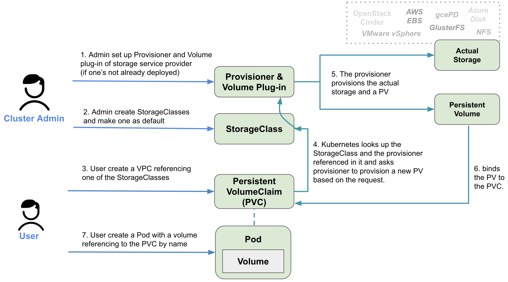

儲存服務大亂鬥： PersistentVolume (PV) 及 PersistentVolumeClaim（PVC) 淺談
===========


雖然我們有了 ConfigMap 跟 Secret 來管理我們的配置文件，但以下兩種情況並不適合用 ConfigMap 跟 Secret 來處理。
1）由應用程式產生的資料，而且你想一直儲存這些資料，即使 Pod 被更新或重新部署也不會消失。
2）太過龐大的資料，因為ConfigMap 跟 Secret 是儲存在 etcd 中，所以有些大型檔案（例如圖片或影片）並不適合用ConfigMap 跟 Secret 來處理。

這時候我們就應該使用 Kubernetes 支援的 Persistent Volume (PV) 來處理


Kubernetes/OpenShift 的存儲架構淺談
----------
理想情況下，在 OpenShift 上部署其應用程序的開發人員永遠不必知道底層使用了哪種儲存技術，
就像他們不必知道正在使用哪種類型的實體服務器來運行其Pod一樣。

為了使應用程序能夠在 Kubernetes/OpenShift 中請求儲存空間而無需處理基礎架構的特定要求，
系統管理員可以先配置 Kubernetes/OpenShift 背後的儲存方案整個請求儲存空間的過程和元件如下圖所示：




### PersistentVolume (PV)

一個 PersistentVolume（PV）資源代表一個儲存空間，由管理員手動設置，或由 OpenShift 使用 StorageClass 動態設置。 
PV 資源不限於任何單一 Project； 它們可以在整個 OpenShift 平台中共享，並可以從任何Project中使用。

### PersistentVolumeClaim（PVC)

PersistentVolumeClaim（PVC）是讓用戶可以請求儲存資源（PV）。
PV 和 PVC 與 Pod 的生命週期無關，即使Pod被重新啟動，更新，甚至刪除，數據也都會被保留。
PVC 會受限於特定單一 Project 內，將 PV 綁定到 PVC 之後，該 PV 便不能再綁定到其他 PVC。
這具有將綁定的 PV 限定到特定單一 Project的作用。


### StorageClass
The Storage Object in Use Protection feature ensures that PVCs in active use by a Pod and PVs that are bound to PVCs are not removed from the system, as this can result in data loss.
Each StorageClass contains the fields provisioner, parameters, and reclaimPolicy, which are used when a PersistentVolume belonging to the class needs to be dynamically provisioned.
Administrators can specify a default StorageClass just for PVCs.


StorageClass 提供 PVC 對應儲存服務供應商的資訊和儲存空間的管理方式。管理員可以為PVC指定默認的 StorageClass。
每個 StorageClass 包含了 Provisioner，對應的參數 和 reclaim 政策等資訊，

Reclaim 政策 告訴平台 當儲存空間被釋放時該如何處理，有下列兩種方式：


- Retain: 允許手動回收這些資源
- Delete: 當PV被刪除時，儲存服務供應商對應的實際儲存單元也會被刪除

### Provisioner

一個 Provisioner 決定那個 `volume plugin` 應該被使用來設定實際儲存單元跟 PV.
請參考 https://docs.openshift.com/container-platform/4.5/storage/dynamic-provisioning.html#available-plug-ins_dynamic-provisioning 看目前 OpenShift 內建有支援那些Ｐlugin

Access Mode
-----------

根據儲存服務提供商，PV 支援三種不同的訪問模式，如下所示

| Access Mode| CLI abbreviation | Description |
| ReadWriteOnce | RWO | The volume can be mounted as read-write by a single node. |
| ReadOnlyMany | ROX | The volume can be mounted as read-only by many nodes.|
| ReadWriteMany | RWX | The volume can be mounted as read-write by many nodes. |


範例 
-----


在我們的環境, 我們預設是使用 "VMware vSphere volumes"。


```YAML
---
apiVersion: v1
kind: PersistentVolumeClaim
metadata:
  labels:
    app: postgres-db
  name: postgres-db
spec:
  accessModes:
  - ReadWriteOnce
  resources:
    requests:
      storage: 5Gi
  storageClassName: vsphere-standard
```

```YAML
apiVersion: extensions/v1beta1
kind: Deployment
metadata:
  annotations:
  labels:
    app: postgres-db
  name: postgres-db
spec:
  replicas: 1
  selector:
    matchLabels:
      app: postgres-db
  strategy:
    type: Recreate
  template:
    metadata:
      labels:
        app: postgres-db
    spec:
      containers:
      - env:
        - name: POSTGRESQL_USER
          value: reference_data_user
        - name: POSTGRESQL_DATABASE
          value: payments-testdb
        - name: POSTGRESQL_PASSWORD
          value: testing
        - name: POSTGRESQL_ADMIN_PASSWORD
          value: testing
        image: quay-ap.windmill.local/gts-base-images/postgresql-96-rhel7:1-52-release
        imagePullPolicy: IfNotPresent
        name: postgres-db
        ports:
        - containerPort: 5432
          name: postgres-db
          protocol: TCP
        volumeMounts:
        - mountPath: /var/lib/postgresql/data
          name: postgresql
      restartPolicy: Always
      volumes:
      - name: postgresql
        persistentVolumeClaim:
          claimName: postgres-db

```


部署到OpenShift。

```
$ oc apply -f /tmp/db-pvc.yaml
persistentvolumeclaim/postgres-db created

$ oc apply -f /tmp/db-deploy.yaml
deployment.extensions/postgres-db created


$ oc get pods
NAME                           READY     STATUS    RESTARTS   AGE
postgres-db-754f6dc5c7-ck8nf   1/1       Running   0          9m

$ oc get pvc
NAME          STATUS    VOLUME                                     CAPACITY   ACCESS MODES   STORAGECLASS       AGE
postgres-db   Bound     pvc-e9c12dab-fed2-11ea-9a08-0050569e649e   5Gi        RWO            vsphere-standard   9m

$ oc get pv pvc-e9c12dab-fed2-11ea-9a08-0050569e649e
NAME                                       CAPACITY   ACCESS MODES   RECLAIM POLICY   STATUS    CLAIM                     STORAGECLASS       REASON    AGE
pvc-e9c12dab-fed2-11ea-9a08-0050569e649e   5Gi        RWO            Retain           Bound     gts-lab-dev/postgres-db   vsphere-standard             10m
```


當我們把 Pod的目標設為 2 會發生什麼事?
--------------


```
$ oc scale deploy postgres-db --replicas=2 
deployment.extensions/postgres-db scaled

$ oc get pods
NAME                           READY     STATUS              RESTARTS   AGE
postgres-db-754f6dc5c7-7khnc   0/1       ContainerCreating   0          8m
postgres-db-754f6dc5c7-ck8nf   1/1       Running             0          42m
```

這是因為我們環境的儲存服務供應商是 `vSphere`, 他不支援 ReadWriteMany 或 ReadOnlyMany 模式。

```
Events:
  Type     Reason              Age              From                                     Message
  ----     ------              ----             ----                                     -------
  Normal   Scheduled           8m               default-scheduler                        Successfully assigned gts-lab-dev/postgres-db-754f6dc5c7-7khnc to sgvlapaacdopa02.windmill.local
  Warning  FailedAttachVolume  8m               attachdetach-controller                  Multi-Attach error for volume "pvc-e9c12dab-fed2-11ea-9a08-0050569e649e" Volume is already used by pod(s) postgres-db-754f6dc5c7-ck8nf
  Warning  FailedMount         1m (x3 over 6m)  kubelet, sgvlapaacdopa02.windmill.local  Unable to mount volumes for pod "postgres-db-754f6dc5c7-7khnc_gts-lab-dev(c38af83c-fed7-11ea-b1e4-0050569e6f56)": timeout expired waiting for volumes to attach or mount for pod "gts-lab-dev"/"postgres-db-754f6dc5c7-7khnc". list of unmounted volumes=[postgresql]. list of unattached volumes=[postgresql default-token-5bblj
```


Clean up
----------

```
$ oc delete deploy postgres-db
deployment.extensions "postgres-db" deleted

$ oc delete pvc postgres-db
persistentvolumeclaim "postgres-db" deleted

$ oc get pvc               
No resources found.

$ oc get pv pvc-e9c12dab-fed2-11ea-9a08-0050569e649e
NAME                                       CAPACITY   ACCESS MODES   RECLAIM POLICY   STATUS     CLAIM                     STORAGECLASS       REASON    AGE
pvc-e9c12dab-fed2-11ea-9a08-0050569e649e   5Gi        RWO            Retain           Released   gts-lab-dev/postgres-db   vsphere-standard             53m
```

這個 PV 仍然存在, 因為我們  `vsphere-standard` StorageClass 的 Reclaim Policy 是 `Retain`
所以我們需要手動刪除這個 PV.


我可以動態增加 PV 的容量嗎？
--------------------------------------------

當資料量隨著時間愈來愈大時，有時候我們可能會需要擴增儲存空間。
而這完全取決於您的儲存服務供應商，而且您還需要為此功能做一些額外的設定。 
詳情請參閱 https://docs.openshift.com/container-platform/4.5/storage/expanding-persistent-volumes.html


結論
-----

就像美國隊長永遠無法取代鋼鐵人的地位，雷神索爾跟綠巨人也不是永遠都那麼萬能。
不同的儲存方案有不同的優缺點和各自的 Backup/Recovery 策略。
在選擇儲存方案時，應該根據你自身的需求和資源來尋找合適的方案，並且在整合進正式環境前先做過完整的測試。
這問題沒有「最佳解」只有「最適解」。Ｇood Luck!


