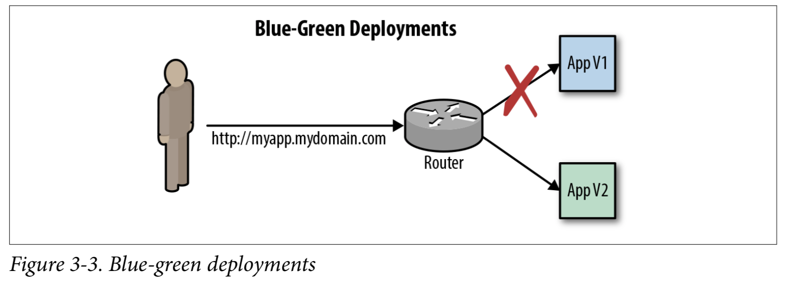
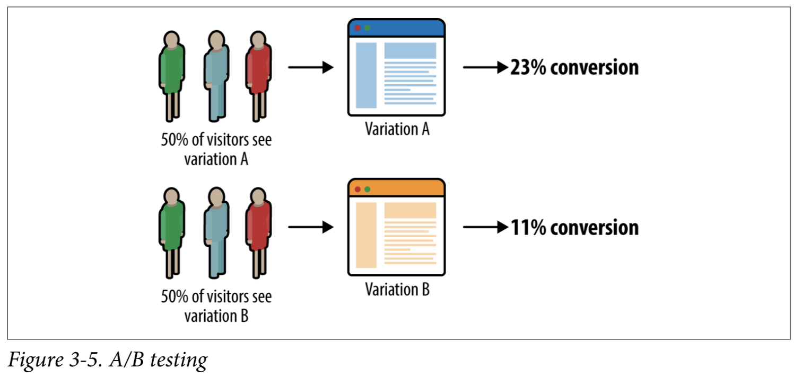
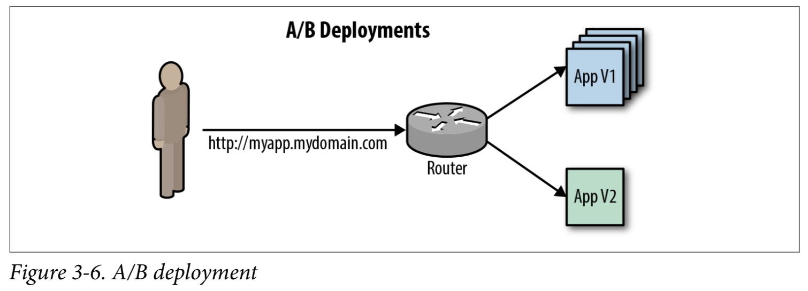

還只會用 "RollingUpdate" 嗎？ 快來看看如何在OpenShift使用進階的 "Blue-Green" 跟 "A/B" 部署策略吧！
====

Route-based Deployment Strategies
========

Except RollingUpdate and Recreate, you can have more flexiable strage to deploy your application base on the OpenSift Route setting - `Blue-Green` Strategies  and `A/B` Strategies.


Prefight
---------

Two deployments and service

version 1

```
---
apiVersion: apps/v1
kind: Deployment
metadata:
  name: nginx-1
  labels:
    app: nginx
spec:
  replicas: 1
  selector:
    matchLabels:
      app: nginx-1
  template:
    metadata:
      labels:
        app: nginx-1
    spec:
      containers:
      - name: nginx
        image: quay.io/brandon_tsai/testlab:1
        imagePullPolicy: Always
        ports:
        - containerPort: 8080
---
apiVersion: v1
kind: Service
metadata:
  name: nginx-1
spec:
  selector:
    app: nginx-1
  ports:
    - protocol: TCP
      port: 80
      targetPort: 8080
```

Version 2

```
---
apiVersion: v1
kind: ConfigMap
metadata:
  name: nginx2-index
data:
  index.html: |
    <html>
    <head>
            <title>Test NGINX 2 passed</title>
    </head>
    <body>
    <h1>NGINX 2 is working</h1>
    </body>
    </html>
---
apiVersion: apps/v1
kind: Deployment
metadata:
  name: nginx-2
  labels:
    app: nginx
spec:
  replicas: 1
  selector:
    matchLabels:
      app: nginx-2
  template:
    metadata:
      labels:
        app: nginx-2
    spec:
      containers:
      - name: nginx
        image: quay.io/brandon_tsai/testlab:1
        imagePullPolicy: Always
        ports:
        - containerPort: 8080
        volumeMounts:
        - name: nginx2-index
          mountPath: /opt/app-root/src
      volumes:
        - name: nginx2-index
          configMap:
            name: nginx2-index
---
apiVersion: v1
kind: Service
metadata:
  name: nginx-2
spec:
  selector:
    app: nginx-2
  ports:
    - protocol: TCP
      port: 80
      targetPort: 8080

```


Apply the basic route nad make sure it works

```
apiVersion: v1
kind: Route
metadata:
  name: nginx
spec:
  host: nginx-uat.apps-crc.testing
  to:
    kind: Service
    name: nginx
```

```
$ oc apply -f route.yml
route.route.openshift.io/nginx created

$ oc get route
NAME    HOST/PORT                    PATH   SERVICES   PORT    TERMINATION   WILDCARD
nginx   nginx-uat.apps-crc.testing          nginx-1    <all>                 None

$ curl http://nginx-uat.apps-crc.testing
<html>
<head>
	<title>Test NGINX passed</title>
</head>
<body>
<h1>NGINX is working</h1>
</body>
</html>
```


Blue-Green Deployments
--------------


The blue-green deployment strategy minimizes the time it takes to perform a deploy‐ ment cutover by ensuring you have two versions of your application stacks available during the deployment (Figure 3-3). We can make use of the service and routing tiers to easily switch between our two running application stacks—hence it is very simple and fast to perform a rollback.





In a stateless application architecture, blue-green deployments can be fairly easy to
achieve as you do not have to worry about:
• Long-running transactions in the original blue stack
• Data stores that need to be migrated or rolled back alongside the application


You can switch route to nginx-2 service very easily by patching the target service name.

```
$ oc patch route/nginx -p '{"spec":{"to":{"name":"nginx-2"}}}'
route.route.openshift.io/nginx patched

$ curl http://nginx-uat.apps-crc.testing
<html>
<head>
        <title>Test NGINX 2 passed</title>
</head>
<body>
<h1>NGINX 2 is working</h1>
</body>
</html>
```

You can switch route back to nginx-1 service very easily by patching the target service name.

```
$ oc patch route/nginx -p '{"spec":{"to":{"name":"nginx-1"}}}'
route.route.openshift.io/nginx patched

$ curl http://nginx-uat.apps-crc.testing
<html>
<head>
	<title>Test NGINX passed</title>
</head>
<body>
<h1>NGINX is working</h1>
</body>
</html>

```

A/B Deployments
------------


A/B deployments get their name from the ability to test the new application features as part of the deployment. This way you can create a hypothesis, perform an A/B deployment, test whether your hypothesis is true or false, and either roll back to your initial application state (A) or proceed with your new application state (B).





A great example is rolling out a change to your sales website or mobile application. You direct a percentage of the traffic to the new version and measure the number of sales by version (conversion rate based on the number of visitors, say).


```
$oc annotate route/nginx haproxy.router.openshift.io/balance=roundrobin
$ oc set route-backends nginx nginx-1=50 nginx-2=50
```


```
$ for i in {1..10}; do curl -s http://nginx-uat.apps-crc.testing | grep "<h1>" ; done
<h1>NGINX is working</h1>
<h1>NGINX 2 is working</h1>
<h1>NGINX is working</h1>
<h1>NGINX 2 is working</h1>
<h1>NGINX is working</h1>
<h1>NGINX 2 is working</h1>
<h1>NGINX is working</h1>
<h1>NGINX 2 is working</h1>
<h1>NGINX is working</h1>
<h1>NGINX 2 is working</h1>
```

And you can adjust the access ratio between nginx-1 and nginx-2 service by simply one command.

```
$ oc set route-backends nginx nginx-1=20 nginx-2=80
route.route.openshift.io/nginx backends updated

$ for i in {1..10}; do curl -s http://nginx-uat.apps-crc.testing | grep "<h1>" ; done
<h1>NGINX 2 is working</h1>
<h1>NGINX 2 is working</h1>
<h1>NGINX 2 is working</h1>
<h1>NGINX 2 is working</h1>
<h1>NGINX is working</h1>
<h1>NGINX 2 is working</h1>
<h1>NGINX 2 is working</h1>
<h1>NGINX 2 is working</h1>
<h1>NGINX 2 is working</h1>
<h1>NGINX is working</h1>
```


Conclusion
-----------
Compare to Kubernetes, it is super easy to achieve "Blue/Green" and "A/B" Test in OpenShift Platform. Which give OpenShift more suitable for enterprise requirement.


Reference
---------

free ebook: [DevOps with OpenShift](https://www.openshift.com/resources/ebooks/devops-with-openshift/)