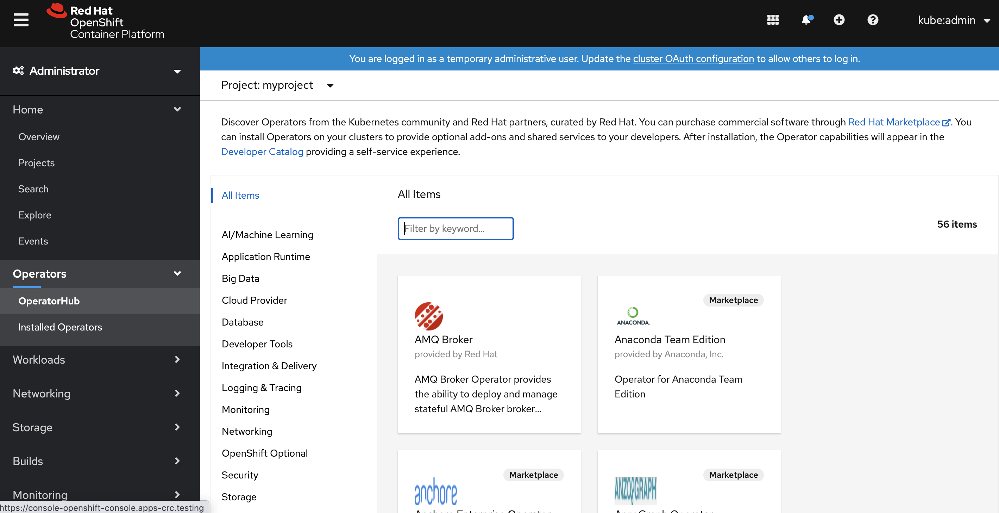
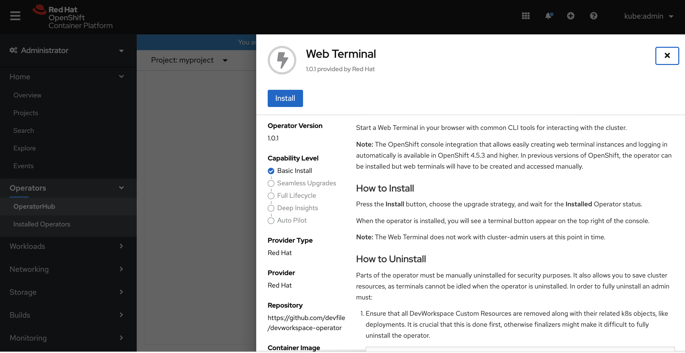
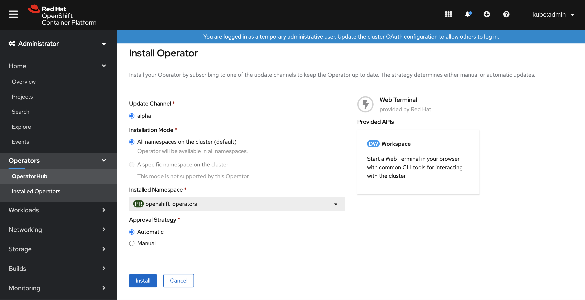
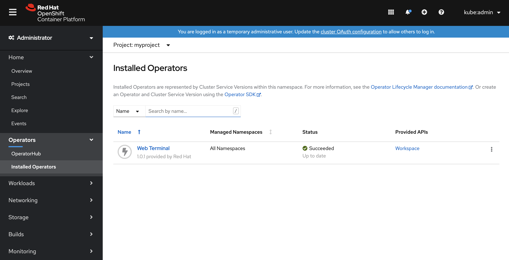
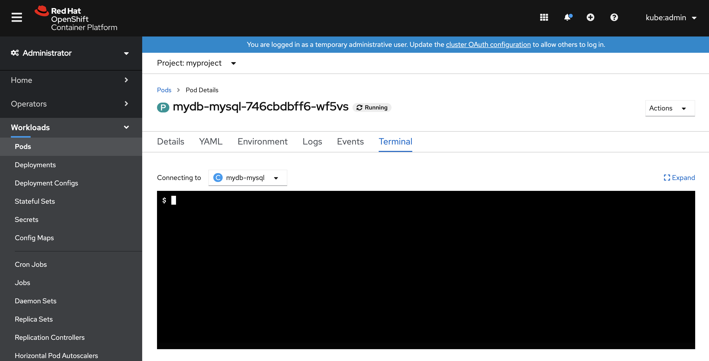

What is Operator?
-----------------

The conventional wisdom of Kubernetes’ earlier days was that it was very good at managing stateless apps. 
But for stateful applications such as databases, it wasn’t such an open-and-shut case: These apps required more hand-holding.

“Adding or removing instances may require preparation and/or post-provisioning steps – for instance, changes to its internal configuration, communication with a clustering mechanism, interaction with external systems like DNS, and so forth,” Thompson explains. “Historically, this often required manual intervention, increasing the DevOps burden and increasing the likelihood of error. Perhaps most importantly, it obviates one of Kubernetes’ main selling points: automation.”

That’s a big problem. Fortunately, the solution emerged back in 2016, when coreOS introduced Operators to extend Kubernetes’ capabilities to stateful applications. (Red Hat acquired coreOS in January 2018, expanding the capabilities of the OpenShift container platform.) Operators became even more powerful with the launch of the Operator Framework for building and managing Kubernetes native applications (Operators by another name) in March 2018. Amidst the broader excitement about Kubernetes, the importance of Operators seems understated – when in fact it would be hard to overstate their importance.

The idea is that when you have an application, like a database like Postgres or Cassandra…any complex application needs a lot of domain-specific knowledge,” Sebastien Pahl, director of engineering, Red Hat OpenShift, explained in a Kubecon 2018 presentation. You can use Kubernetes tools to try and solve some of those problems

Operator Framework
------------------
Operator Framework is an open source toolkit designed to manage Kubernetes Operators, in a more effective, automated, and scalable way.  It is not just about writing code; testing, delivering, and updating Operators is just as important. The Operator Framework components consist of open source tools to tackle these problems:

Operator SDK
The Operator SDK assists Operator authors in bootstrapping, building, testing, and packaging their own Operator based on their expertise without requiring knowledge of Kubernetes API complexities.

Operator Lifecycle Manager
Operator Lifecycle Manager (OLM) controls the installation, upgrade, and role-based access control (RBAC) of Operators in a cluster. Deployed by default in OpenShift Container Platform 4.5.

Operator Registry
The Operator Registry stores ClusterServiceVersions (CSVs) and Custom Resource Definitions (CRDs) for creation in a cluster and stores Operator metadata about packages and channels. It runs in a Kubernetes or OpenShift cluster to provide this Operator catalog data to OLM.

OperatorHub
OperatorHub is a web console for cluster administrators to discover and select Operators to install on their cluster. It is deployed by default in OpenShift Container Platform.

Operator Metering
Operator Metering collects operational metrics about Operators on the cluster for Day 2 management and aggregating usage metrics.

These tools are designed to be composable, so you can use any that are useful to you.

Deploy first Operator
---------------------

When Login as kubeadmin, you can see OperatorHub as following

Search Web Terminal Operator

Install Web Terminal Operator with default settings

Check Operator status

Make sure user can connect into pod via Terminal from Web UI.

Reference
--------

It is very useful for Operator to deploy Production level, High Availaity Service for complexity application such as Storage service and Database.

I will introduce some useful Operator for managing OpenShift Cluster.

https://enterprisersproject.com/article/2019/2/kubernetes-operators-plain-english?page=1